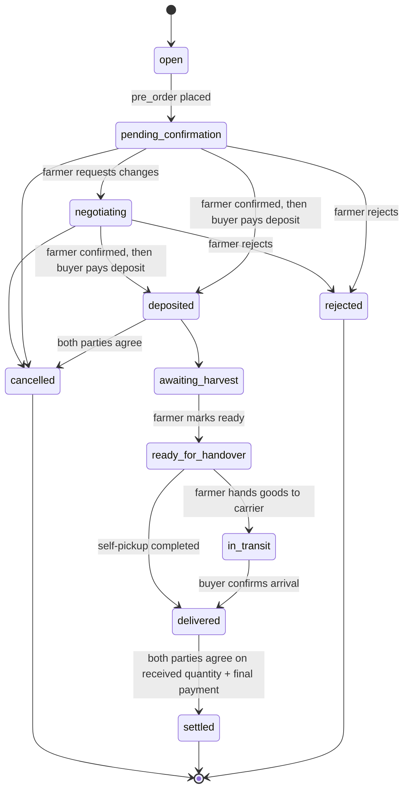

# 00. Project Charter — FRESH O!

## 1. Product Summary

FRESH O! is a mobile app and website connecting farmers (supply side) with bulk buyers (demand side: restaurants, kitchens, food stores) through a "pre-harvest booking" model. Farmers post an upcoming harvest 7-14 days before it is ready; buyers reserve part or all of the batch in advance. The platform mediates matching, deposits, logistics quoting, delivery tracking, and post-delivery settlement.

This charter states only what is required to write correct code. Full business rationale lives in `docs/`; do not duplicate it here.

## 2. Actors & Roles

| Actor | Description | Core permissions |
|---|---|---|
| Farmer | Posts harvest batches, confirms/rejects pre-orders, updates harvest progress | Full CRUD on own batches; read/write on own orders |
| Buyer | Searches batches, places pre-orders, confirms receipt | Read on public batches; read/write on own orders |
| Operator/Admin | Platform staff monitoring transactions and disputes | Read on all orders; write on dispute resolution and moderation |
| Logistics partner | Fulfills shipping requests | Read/write on assigned delivery records only |
| AI assist | Suggests price range, packaging, buyer-batch matching, demand forecast | Advisory output only; never final decision-maker on price or order state |

## 3. Domain Glossary

Use these English identifiers consistently across code, database, and API. Do not invent synonyms.

| Vietnamese term | English identifier | Notes |
|---|---|---|
| Mùa vụ / lô hàng | `harvest_batch` | One posted harvest listing |
| Đặt trước | `pre_order` | A buyer's reservation against a batch |
| Đặt cọc | `deposit` | Partial payment securing a `pre_order` |
| Đối soát | `settlement` | Final reconciliation of quantity, price, deposit, shipping fee |
| Uy tín | `trust_score` | Rating accumulated per actor from completed orders |
| Cước vận chuyển | `shipping_fee` | Always quoted separately from goods price |
| Bàn giao | `handover` | Physical transfer event, self-pickup or carrier pickup |
| Thỏa thuận | `order_agreement` | A proposal on one `pre_order` (final received quantity, or cancelling a deposited order with a refund amount) that takes effect only when the other party accepts |

## 4. Order Lifecycle State Machine

`negotiating` covers the "Trao đổi" branch from docs §2a (farmer needs to align on packaging/timing before deciding): reached only from `pending_confirmation`, and resolves the same way `pending_confirmation` does (confirm/reject/cancel) — it does not add any new terminal state or bypass the confirm-before-deposit rule.

Confirm-before-deposit: the farmer's confirmation is recorded on the `pre_order` (`farmer_confirmed_at`) and leaves `pending_confirmation`/`negotiating` unchanged; the buyer's deposit is only accepted after it and moves the order to `deposited`. A farmer who has confirmed cannot move the order to `negotiating`.

Two-party agreements: settlement (buyer proposes the final received quantity, farmer accepts) and cancelling a `deposited` order (either party proposes a refund amount, the other accepts) are stored as `order_agreement` rows and never change the order by themselves. A pending proposal expires when the order changes status. Shipping in settlement is the estimated `shipping_fee` (carrier orders) or 0 (self-pickup); a surplus deposit is returned through an append-only `deposit_refund` ledger entry.

Carrier orders have no logistics-partner assignment in this scope: the farmer marks `in_transit` and the buyer marks `delivered`.

This is the single source of truth for order status values. Any module reading or writing order status MUST reference this exact set of states; do not introduce ad hoc statuses.

## 5. Ambiguity-Handling Policy

When the business context does not specify enough detail to implement a feature:

1. Choose the simplest assumption consistent with the state machine and glossary above.
2. Mark the assumption inline: `// TODO(business-confirm): <assumption and why>`.
3. Never invent financial, legal, or payout logic beyond what is explicitly stated; stop and ask instead.

## 6. Explicitly Out of Scope for This Project

This charter intentionally omits the heavy-process elements used in other workspaces:

- No Anti-One-Shot 4-step gate on every code-modifying turn.
- No `.ops-memory/` decision ledger.
- No mandatory academic-grounding hierarchy.

Code is written directly against this charter and normal code review, not against a frozen requirements deliverable.
