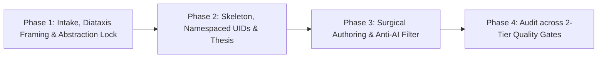
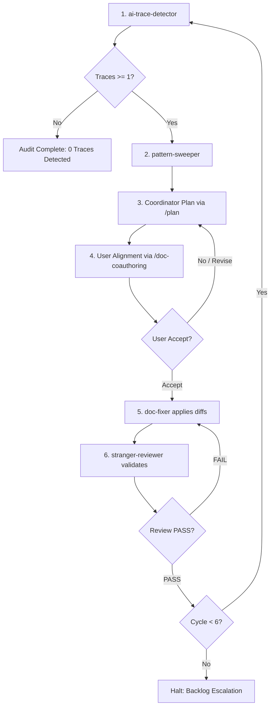

# Universal Technical Document Author (technical-doc-author)

Specialized skill for authoring, restructuring, standardizing, and auditing production-grade engineering documentation under mechanical anti-AI discipline, proportional rigor, and strict abstraction layer boundaries across 8 core industry document types.

## When to Activate

Activate when the user requests:
- Authoring, updating, restructuring, or standardizing technical engineering documents including:
  1. Software / Product Requirements Specifications (SRS / PRD).
  2. Software / System Design Descriptions (SDD / Architecture Overviews).
  3. Architecture Decision Records (ADR).
  4. Engineering Proposals and Request for Comments (RFC).
  5. Technical Investigation and Benchmark Reports (Performance tests, evaluations, security audits).
  6. Incident Postmortems and Root Cause Analyses (RCA / Incident Retrospectives).
  7. API Specifications and Data Schema Contracts.
  8. Operational Runbooks, How-to Guides, and Standard Operating Procedures (SOP).
- Auditing, reviewing, humanizing, eliminating LLM stylistic residue, or repairing syntax collisions in technical documents.
- Executing multi-subagent anti-AI audit, trace detection, pattern sweeping, or iterative decontamination loops on target technical documents.
- Restructuring visual diagrams (native Mermaid, layered architectures, sequence diagrams, statecharts, incident fault trees) and enforcing cross-modal parity between diagrams and text.
- Establishing bidirectional traceability matrices or quantitative evidence chains.

Activation keywords: `technical documentation`, `author SRS`, `write SDD`, `draft ADR`, `write RFC`, `technical report`, `benchmark report`, `incident postmortem`, `root cause analysis`, `rca`, `api spec`, `standardize documentation`, `humanize doc`, `diataxis`, `runbook`, `anti-ai audit loop`, `decontamination loop`, `multi-subagent anti-ai audit`, `ai trace detector`, `pattern sweeper`, `doc fixer`, `stranger review`, `purge ai traces`.

Do NOT activate when:
- Writing general application source code (use general coding agents).
- Diagnosing runtime stack traces or debugging application code (use dedicated interactive code debugging or system architecture tools/skills).
- Drafting marketing copy, creative promotional articles, or sales emails.

---

## Overview

This skill positions the agent as a Lead Technical Document Architect responsible for defining structural schemas, establishing technical abstraction boundaries, and enforcing mechanical quality standards for all engineering documentation.

Seven core pillars:
1. **Abstraction Layer & Purpose Governance**: Strict alignment with the document's target domain (Problem WHAT, Solution HOW, Decision WHY, Empirical Investigation, Operational Retrospective, or Procedure). Prevents premature design or micro-level implementation leakage into requirements and prevents turning analytical reports into academic textbooks.
2. **Diataxis Framework & Audience Positioning**: Exact classification into one of the four Diataxis quadrants: Tutorials, How-to Guides, Reference, or Explanation / Investigation. Adopts an objective, active-voice engineering tone following Google Developer Documentation principles.
3. **Monolingual Discipline & Mechanical Anti-AI Filtering**: Total elimination of LLM writing artifacts including em-dashes, faux-contrast "Not X but Y" constructions, forced adjective triads, mechanical bold-first bullet lists, fractal repetition, and redundant bilingual parenthetical tags.
4. **Proportional Rigor & Syntax Defense**: Elimination of spurious mathematical precision (academic overkill for routine business logic) while maintaining mathematical rigor for complex algorithmic models. Zero unescaped pipe conflicts in Markdown tables, seamless code fences, and standard GitHub Flavored Markdown admonitions.
5. **Tiered Visual Modeling & Multimodal Parity**: Decomposition of complex architectures and workflows into two clean visual tiers (maximum 9 nodes per diagram). Strict goal-oriented entity modeling (`<Verb> + <Noun>`), elimination of CRUD bundles ("Manage X"), and 100% parity between diagram elements and textual specifications (zero phantom entities).
6. **Self-Containment, Neutral Third-Person & Context Deduplication**: Creation of fully self-contained documents that never deflect specification responsibilities to unrequested external documents in the body. Strict adoption of neutral, objective third-person perspective (zero first/second-person pronouns). Elimination of redundant high-level context repetition in sub-sections (sub-sections enter directly with local technical facts).
7. **End-to-End Impact Governance & Value Preservation**: When receiving change requests, updates, or bug fixes, perform an end-to-end analysis of the entire document or project, evaluate cascading risks, preserve existing optimal structures and metrics, selectively upgrade outdated points, and align trade-offs with the user before authoring.

---

## Instructions (4-Phase Sequential Workflow)

The documentation lifecycle executes through four sequential phases adaptable to any technical document type:



### Phase 1: Intake, Diataxis Framing, and Abstraction Layer Lock

Step 1. Determine target document category among the 8 core types:
Consult `references/document-types-matrix.md` to identify the document category:
- `DOC-1`: Requirements Specification (SRS / PRD)
- `DOC-2`: System Design Description (SDD / Arch Spec)
- `DOC-3`: Architecture Decision Record (ADR)
- `DOC-4`: Engineering Proposal / RFC
- `DOC-5`: Technical Report / Benchmark Evaluation
- `DOC-6`: Incident Postmortem / Root Cause Analysis (RCA)
- `DOC-7`: API Specification / Data Schema Contract
- `DOC-8`: Operational Runbook / SOP

Step 2. Map to a single Diataxis functional quadrant:
- **Tutorials**: Learning-oriented. Guides a beginner through an unbroken sequence of hands-on steps from initial setup to a working result.
- **How-to Guides / Runbooks**: Goal-oriented. Directs a practitioner through the steps required to solve a specific real-world problem or execute an operational task.
- **Reference**: Information-oriented. Provides dry, authoritative descriptions of parameters, configurations, API schemas, error codes, and constraints.
- **Explanation / Investigation (Technical Reports & RFCs)**: Understanding-oriented. Clarifies architectural context, design rationale, empirical benchmarks, or postmortem retrospectives.
Do not blend multiple Diataxis quadrants within the same section.

Step 3. Lock information domain boundaries and abstraction level:
- Requirements Domain WHAT (SRS, PRD): Define business goals, system context, actors, immutable business rules, and verifiable functional requirements. Forbid design-phase abstractions (class diagrams, design patterns) and programming-language-specific methods or exception class names. All error paths must be technology-agnostic business validations.
- Solution Domain HOW (SDD, Architecture Overview): Define subsystem topology, layered structures, design patterns, network protocols, and data schemas. Never duplicate business rule narratives from requirements; reference requirement IDs (`REQ-xxx`, `BR-xxx`).
- Decision Domain WHY (ADR): Record technical context, considered options, decision drivers, evaluated trade-offs, and technical consequences.
- Empirical Investigation (Tech Report, Benchmark): Define hypotheses, test topologies, parameter sweeps, empirical metrics, and statistical analysis. Never convert into promotional brochures.
- Operational Retrospective (Postmortem): Record incident symptoms, chronology timeline, root cause analysis (5 Whys), and actionable remediation items. Never attribute blame to individuals.
- Operational Procedure (Runbook, SOP): Focus on sequential operator actions required to deploy, operate, backup, or recover system components with verification checks and rollback routines.

Step 4. Enforce Zero Textbook Syndrome and Proportional Rigor:
- Engineering documentation targets practitioners and review committees. Never write introductory theoretical lectures or insert academic summaries of psychological laws (such as Miller's law or Conway's law) before diagrams and specification tables.
- Eliminate Spurious Mathematical Precision (Academic Overkill): In standard business applications, forbid first-order predicate calculus ($\forall, \exists, \exists!$) or trivial cancellation algebra for routine CRUD rules. State rules directly using declarative engineering prose or numerical constraint tables. Reserve mathematical formalism for genuine cryptographic, algorithmic, or formal verification specifications.

Step 5. Enforce Document Self-Containment and Reference Permissions:
- Verify whether the user explicitly requested external reference citations or standard reference sections.
- When unrequested, enforce complete document self-containment: forbid all deflecting references to external or separate documents in body text ("refer to Document X for details").
- When explicitly requested, isolate 100% of external references in a single dedicated section (`## References` or `## Tài liệu tham khảo`).

Step 6. End-to-End Impact Audit & Blast Radius Lock (Document Evolution):
When editing, refactoring, or updating an existing technical document:
- Map the complete dependency chain: upstream business goals, functional requirements, architectural models, test cases, and breaking points.
- Evaluate cascading risks: inconsistencies, metric degradation, broken references, or ripple effects on downstream consumers.
- Deliberative alignment: If proposed modifications carry substantial trade-offs, potential breaking changes, or require revising verified invariants, summarize the blast radius and align the proposed resolution with the user before rewriting.

### Phase 2: Skeleton Design, Namespaced Identifiers, and Technical Thesis

Step 1. Normalize headings and hierarchical identifier placement (POLA & Namespacing):
Every section containing a traceable engineering entity must place its unique identifier immediately after the section numbering: `### X.Y [UID]: [Entity Name]`.
Enforce hierarchical domain namespace (`[PREFIX]-[DOMAIN/TOPIC]-[NN]`) reflecting the system's decomposition:
- Requirements: `### 2.1 BR-FIN-01: Account Balance Preservation Invariant`, `### 3.1 REQ-NET-01: Ingress Rate Limiting`
- Architecture & Design: `### 2.1 CMP-AUTH-01: OAuth 2.0 Token Validator`, `### 3.1 ADR-004: PostgreSQL Selection for Ledger Persistence`
- Reports & Benchmarks: `### 4.1 HYP-MEM-01: Zero-Copy Serialization Throughput`, `### 5.1 FIND-PERF-02: Connection Pool Contention`, `### 6.1 REC-ARCH-01: Read-Replica Offloading`
- Postmortems: `### 2.1 INC-202609-01: Ingress Gateway Saturation`, `### 4.1 ACT-RES-01: Automated Circuit Breaker Tuning`
Forbidden pattern 1: Never append identifiers inside parentheses at the end of headings.
Forbidden pattern 2: Forbid flat, linear, non-namespaced numbering (`ID01`, `REQ01`, `UC01`, `FIND01`). Flat numbering violates the Principle of Least Astonishment (POLA) and indicates synthetic list generation.
Enforce Context Hierarchy Inheritance: Sub-sections implicitly inherit the parent context. Forbid opening sentences that re-state high-level system context, project goals, or business problems defined in parent sections. Sub-sections enter directly with local technical facts.

Step 2. Streamline child table column headers:
When a table resides under a section with a clear identifier and contextual heading, minimize column header titles to avoid redundant parent keywords:
- Parameter table: `| Parameter | Type | Required | Constraints | Default |`
- Action items table: `| UID | Action | Assignee | Target Date | Status |`
- Benchmark metrics: `| Metric | Baseline | Observed | Target | Status |`

Step 3. Establish technical thesis and trade-off analysis:
All architectural documents, RFC proposals, benchmark reports, and system designs must open with a technical thesis statement defining what specific problem the solution addresses, under what workload envelope, and which design constraints are intentionally accepted.
Document at least three realistic trade-off axes:
- Latency versus memory consumption or network bandwidth.
- Consistency versus availability under network partitions (CAP/PACELC).
- Development velocity versus operational complexity and infrastructure cost.
Identify the explicit breaking point: the load volume, dataset scale, or concurrency threshold where the architecture degrades and requires structural re-architecting. Never claim an architecture is universally optimal without trade-offs.

Step 4. Enforce bidirectional evidence closure / traceability:
Establish an unbroken two-way traceability chain appropriate for the document type:
- Software Specifications: `Business Goals <-> Business Rules <-> Functional Requirements <-> Verification Tests`
- Technical Investigations: `Hypotheses <-> Test Setup <-> Observed Data <-> Findings <-> Recommendations`
- Incident Postmortems: `Alert Symptoms <-> Timeline Events <-> Root Cause Analysis <-> Remediation Actions`
Ensure zero orphaned requirements, findings, or remediation actions.

Step 5. Plan tiered visual modeling and goal-oriented semantics:
Consult `references/visual-modeling-guide.md`. Apply visual decomposition principles:
- Tier 1: System topology or macro workflow overview (<= 9 nodes).
- Tier 2: Focused subsystem decomposition, protocol sequence, or component statechart (<= 9 nodes).
- Discrete Goal-Oriented Entity Naming: Model units of behavior as complete goals formatted as `<Active Verb> + <Direct Object>` (`Validate Security Token`, `Settle Account Ledger`). Forbid lazy CRUD bundles ("Manage X" / "Quản lý X") that collapse distinct operations into an amorphous God entity.
- Strict Relationship Semantics: Never use optional extension links (`<<extend>>`) to connect mutually exclusive execution branches; model mutually exclusive scenarios as independent paths. Never use inclusion links (`<<include>>`) for simple sequential steps.
- Zero Phantom Entities (Cross-Modal Parity): 100% diagram nodes and identifiers MUST have matching detailed text sections in the document body.
- Diagram Utility: In single-actor local systems, avoid decorative use case diagrams that merely recreate the UI menu; prioritize pipeline flowcharts or entity statecharts.

### Phase 3: Surgical Authoring and Anti-AI Filter

Step 1. Apply monolingual discipline:
Draft documents entirely in the requested target language. Avoid bilingual parenthetical glosses following established technical terms (`Overview (Tổng quan)`, `Configuration (Cấu hình)`). Consult `references/anti-ai-technical-catalog.md`.

Step 2. Enforce mechanical anti-AI rules:
- Em-dashes: Zero em-dash characters (`—`) and zero double hyphens (`--`) used as sentence punctuation dashes. Use periods, commas, colons, or clean structural rewrites.
- Faux-contrast phrasing: Zero "Not X but Y" sentence constructions. State technical specifications, capacities, and constraints directly.
- Forced triads: Zero groupings of three consecutive adjectives or parallel buzzwords. Use single precise technical terms or tabular verification metrics.
- Bold-first bullet lists: Zero bullet lists that mechanically bold the first phrase of every item. Use continuous technical prose or structured Markdown tables.
- Fractal repetition: Zero introductory or closing summaries that repeat body text. Every technical specification appears once in its authoritative section.
- Tiered vocabulary filter: Zero occurrences of Tier-1 banned filler words (`delve`, `tapestry`, `landscape`, `pivotal`, `foster`, `robust`, `leverage`, `seamless`, `utilize`). Zero fluff clusters.
- RFC 2119 keywords: Use standard normative keywords (MUST, MUST NOT, SHOULD, RECOMMENDED, MAY, OPTIONAL) directly without meta-explanatory commentary.
- Point of view: Zero first-person (`we`, `our`, `chúng tôi`, `chúng ta`) or second-person (`you`, `bạn`) pronouns outside verbatim code/quotes. Use third-person technical entities (`The service`, `The operator`, `Hệ thống`) or imperative verbs in runbooks.
- Neutral technical tone: Zero emotional, promotional, or subjective descriptors (`superior`, `effortless`, `tuyệt vời`, `ưu việt`). Replace with empirical benchmarks or binary Pass/Fail criteria.
- Document self-containment: Zero deflecting references to unverified external documents in body text (`refer to document X for details`). Consolidate permitted citations 100% into a dedicated reference section.
- Value preservation & anti-regression: Never degrade existing high-rigor specifications, detailed numerical metrics, or verified architectural diagrams to resolve a narrow localized feedback item ("càng sửa càng sai"). Retain all optimal, compliant content and surgically replace only invalid, outdated, or conflicting sections.

Step 3. Defend Markdown syntax and mathematical notation:
Consult `references/syntax-engineering-guide.md`.
- Mathematical delimiters in tables: Zero bare pipe characters (`|`) inside LaTeX math formulas embedded within Markdown tables. Replace bare pipes with `\lvert ... \rvert`, `\vert ... \vert`, or `\mid`.
- Code and diagram fences: Ensure triple backticks and language identifiers are seamless without intervening whitespace (e.g., ```` ```mermaid ````). Strip raw escape character artifacts (`\n\n`, `\t`).
- Admonition callouts: Restrict callouts to standard GitHub Flavored Markdown syntax (`> [!NOTE]`, `> [!TIP]`, `> [!IMPORTANT]`, `> [!WARNING]`, `> [!CAUTION]`). Never nest callouts or place consecutive callout boxes.

Step 4. Enforce quantitative acceptance and evaluation criteria:
Every quality metric, acceptance threshold, or experimental finding must specify a numerical threshold with measurable tolerance. Forbid vague qualitative adjectives such as fast, responsive, high security, reliable, or optimal.

### Phase 4: Independent Audit across 2-Tier Quality Gates

Before finalizing any technical document, audit the output across the two-tier quality gate framework:

#### Layer 1: Universal Core Gates (Mandatory for 100% of Technical Documents)
- [ ] **Gate U1 (Functional Purpose & Diataxis Consistency)**: Document aligns cleanly with 1 Diataxis quadrant; zero pedagogical textbook lectures. (Pass/Fail)
- [ ] **Gate U2 (Single-Language Linguistic Integrity)**: Zero redundant bilingual parenthetical translation tags appended to standard terms. (Pass/Fail)
- [ ] **Gate U3 (Anti-AI Stylistic Tell Filtration)**: Zero em-dashes or double-hyphen punctuation; zero forced triads; zero "Not X but Y" phrases; zero Tier-1 AI vocabulary; zero bold-first bullet lists. (Pass/Fail)
- [ ] **Gate U4 (Table Delimiter & Math Integrity)**: Zero bare pipe characters inside LaTeX math blocks in Markdown tables; `\lvert ... \rvert`, `\lVert ... \rVert`, or `\mid` used consistently. (Pass/Fail)
- [ ] **Gate U5 (Code Fence, Callout & Escape Hygiene)**: Zero spaces after triple backticks in code fences; zero unparsed escape sequences; callout blocks comply with GitHub Flavored Markdown. (Pass/Fail)
- [ ] **Gate U6 (Thesis Statement, Proportional Rigor & Trade-Off Realism)**: Explicit thesis statement present; zero spurious mathematical formalisms for trivial logic; at least 3 concrete engineering trade-off axes analyzed; breaking point or operational boundary defined. (Pass/Fail)
- [ ] **Gate U7 (Document Self-Containment & Isolated Reference)**: Document is fully self-contained; zero deflecting cross-document references in body text; reference section appears only upon explicit request and is 100% isolated. (Pass/Fail)
- [ ] **Gate U8 (Strict 3rd-Person Perspective & Neutral Tone)**: Zero first-person (`we`, `us`, `our`, `chúng tôi`) or second-person (`you`, `bạn`) pronouns; zero subjective emotional or promotional adjectives. (Pass/Fail)
- [ ] **Gate U9 (Context Deduplication & Direct Entry)**: Sub-sections inherit parent context statically; zero opening sentences repeating high-level system context or project mission; immediate entry with local technical entities, parameters, or constraints. (Pass/Fail)
- [ ] **Gate U10 (End-to-End Impact Analysis & Value Preservation)**: End-to-end blast radius across dependent sections verified; existing optimal structures and metrics preserved; zero cascading regression errors; explicit user alignment completed when breaking trade-offs exist. (Pass/Fail)

#### Layer 2: Context-Adaptive Extension Gates (Evaluated Based on Document Type)
- [ ] **Gate E1 (Abstraction Layer & Scope Boundary Purity)**:
  - In SRS/PRD: Zero detailed design terms, source code methods, or language exception classes.
  - In SDD/Arch Spec: Zero duplicated business requirement text; 100% design elements reference requirement UIDs.
  - In Tech Reports: Zero unsupported conclusions lacking empirical test data.
  - In Postmortems: Zero personal blame attributions; 100% focus on systemic/process root causes. (Pass/Fail)
- [ ] **Gate E2 (Structured Namespaced UID Placement & POLA)**:
  - 100% section headings with traceable entities follow `### X.Y [UID]: [Name]`.
  - 100% UIDs feature hierarchical domain namespaces (`REQ-`, `CMP-`, `FIND-`, `REC-`, `INC-`, `ADR-`); zero flat non-namespaced UIDs (`ID01`, `UC01`, `REQ01`). (Pass/Fail)
- [ ] **Gate E3 (Tiered Visual Modeling, Semantics & Multimodal Parity)**:
  - 100% complex architectures split into two tiers (maximum 9 nodes per diagram).
  - 100% behavioral units represent discrete goals (`<Verb> + <Noun>`); zero lazy CRUD bundles ("Manage X").
  - Zero optional extension links connecting mutually exclusive branches.
  - **Cross-Modal Parity**: 100% diagram nodes have matching textual explanations in the document body (zero phantom entities).
  - Zero decorative diagrams merely replicating UI menus. (Pass/Fail)
- [ ] **Gate E4 (Quantitative Evidence & Traceability Closure)**:
  - 100% acceptance criteria, performance metrics, or experimental findings include numerical metrics with explicit tolerances.
  - Bidirectional traceability chain provides 100% coverage with zero orphaned entities (Requirements <-> Tests, Symptoms <-> Root Cause <-> Actions, Hypotheses <-> Data <-> Conclusions). (Pass/Fail)

---

### Execution Modes: Mode A (Direct Authoring & Standard 2-Tier Audit) vs Mode B (Multi-Subagent Anti-AI Audit & Decontamination Loop)

This skill operates in two execution modes depending on user intent:
- **Mode A: Direct Authoring & Standard 2-Tier Audit**: Use when authoring or updating documents from scratch following the 4-Phase Sequential Workflow above.
- **Mode B: Multi-Subagent Anti-AI Audit & Decontamination Loop**: Use when auditing, reviewing, humanizing, or systematically purging LLM stylistic residue from an existing target document.

#### Mode B Protocol: 5-Role Multi-Subagent Loop

When Mode B triggers, the primary coordinator orchestrates 4 specialized worker subagents under strict Subagent-Driven Development (SDD) discipline:

1. **Subagent `ai-trace-detector`**:
   - Reads 100% of the target document; zero self-fixing.
   - Evaluates every detected trace through the mandatory **Tri-Role Lens**:
     * *AI Stylistic Tell Detector*: Identifies exact mechanical violation against `references/anti-ai-technical-catalog.md` and Universal Core Gates (Gate U1–U10) / Extension Gates (Gate E1–E4) defined in this skill, augmented by any project-specific engineering documentation standards or rules discovered in the workspace.
     * *Academic & Rigor Evaluator*: Assesses whether the trace degrades academic credibility, introduces textbook preach, spurious math, or abstraction leakage.
     * *Industry Tech Lead Reader*: Assesses whether the trace sounds synthetic, hollow marketing fluff, un-actionable, or untrustworthy to senior engineers.
   - Emits table: `| Line | Raw Snippet | Trace Classification | Tri-Role Findings |`. Emits explicit "0 traces detected" report if clean.
2. **Subagent `pattern-sweeper`**:
   - Dispatched only when `ai-trace-detector` catalogues $\ge 1$ trace.
   - Sweeps the entire document for all identical or isomorphic instances of each flagged pattern.
   - Emits table: `| Pattern Type | Detection Rule / Regex | Total Occurrences | All Matched Lines |`.
3. **Confirmation Checkpoint (Primary Coordinator)**:
   - Formulates a structured remediation plan (`/plan`): Problem & blast radius, minimum 2 actionable options with explicit trade-offs (e.g. surgical keyword replacement vs structural rewrite), and recommended direction with rationale.
   - Presents the plan to the user (`/doc-coauthoring`) in natural target language (natural Vietnamese without trailing English glosses in parentheses).
   - **Immutable Gate**: FORBIDDEN from dispatching `doc-fixer` without explicit user acceptance (`accept` / `đồng ý`).
4. **Subagent `doc-fixer`**:
   - Dispatched ONLY after explicit user acceptance of the checkpoint plan.
   - Applies the approved plan to all swept locations, strictly adhering to the 2-tier quality gates defined in this skill and applicable project documentation guidelines.
   - Blast Radius Lock: Forbidden from modifying lines outside approved scope.
   - Emits unified diff of changes.
5. **Subagent `stranger-reviewer`**:
   - Dispatched immediately after `doc-fixer` completes edits.
   - Independent blind audit: Confirms zero new AI stylistic tells introduced and 100% preservation of original technical/business semantics.
   - Emits binary `PASS` or `FAIL` with specific remediation recipes.



**Mechanical Stopping Conditions (Loop Control)**:
1. `ai-trace-detector` reports 0 traces in a full-document scan.
2. User explicitly issues verbal stop command (e.g. "dừng lại", "tài liệu đã đạt").
3. Hard ceiling: Maximum 6 iteration cycles. If reached without Condition 1, coordinator halts and escalates residual backlog to the user.

Consult `references/anti-ai-audit-loop.md` for turnkey subagent dispatch prompt templates.

---

## Output Contract

### Mode A: Direct Authoring Output Contract

Publish completed technical engineering documents enclosed in a single standalone Markdown code block per the schema below. Never prefix or suffix the document block with conversational commentary, pleasantries, or meta-explanations:

````markdown
# [Document Title]

[Full technical document content complying with universal structural standards]
````

### Mode B: Decontamination Loop Output Contract

During Mode B execution, each phase emits a dedicated structured artifact:
1. **Detection Pass (`ai-trace-detector`)**: Emits the Tri-Role findings table:
   `| Line | Raw Snippet | Trace Classification | Tri-Role Findings (Detector / Academic / Practitioner) |`
2. **Global Sweep (`pattern-sweeper`)**: Emits the pattern incidence table:
   `| Pattern Type | Detection Rule / Regex | Total Occurrences | All Matched Lines |`
3. **Confirmation Checkpoint**: Emits a structured remediation proposal (`/plan`) with Problem description, Options A & B with trade-offs, and Recommended direction.
4. **Surgical Diff (`doc-fixer`)**: Emits a unified diff specifying target file path, line numbers, original text, and modified text.
5. **Stranger Verification (`stranger-reviewer`)**: Emits binary `PASS` or `FAIL` verdict with itemized quality gate compliance check.

---

## Anti-Examples Matrix

| Audit Dimension | AI Anti-Pattern | Universal Engineering Standard | Mechanical Verification (Pass/Fail) |
|---|---|---|---|
| Abstraction Leakage | Inserting language library calls (`BigDecimal.add()`), language exceptions, or class schemas into requirements. | Describe system boundary, external actors, business rules, and functional criteria independently of language syntax. | Count of implementation keywords, code methods, or exception names in requirements equals 0. |
| Spurious Mathematics | Writing $\forall c \in Categories, \exists! g$ or $\Delta \sum Balance = 0$ for routine CRUD rules. | State rules directly with unambiguous declarative prose or numerical condition tables. | Count of predicate calculus expressions for routine CRUD logic equals 0. |
| Theoretical Preach | Inserting paragraphs on Miller's Law (7 plus minus 2) or Conway's Law before diagrams. | Present technical diagrams accompanied by concise tabular entity specifications. | Count of pedagogical philosophy lectures equals 0. |
| Diataxis Consistency | Blending API error tables into introductory getting-started tutorials. | Separate into four distinct Diataxis quadrants; place API error schemas in Reference. | 100% of document maps to 1 Diataxis quadrant; cross-quadrant leakage equals 0. |
| Flat Numbering (POLA) | Numbering entities with flat linear codes: `ID01`, `REQ01`, `UC01`, `FIND01`. | Use hierarchical domain namespacing: `REQ-NET-01`, `CMP-DB-02`, `FIND-LOAD-01`, `REC-SEC-01`. | Count of flat UIDs lacking domain namespace equals 0. |
| Identifier Placement | Appending entity IDs at the end of headings in parentheses: Ingress Rate Limiting (REQ-01). | Position UID immediately after section numbers: 3.1 REQ-NET-01: Ingress Rate Limiting. | 100% of entity headings match `### X.Y [UID]: [Name]`. |
| CRUD / God Entity Smell | Naming entities with generic CRUD bundles: "Manage Accounts" / "Quản lý tài khoản". | Name behavioral units as discrete Goals: `<Active Verb> + <Direct Object>` ("Authenticate User", "Settle Ledger"). | Count of entity titles starting with "Manage..." or "Quản lý..." equals 0. |
| Diagram Relationship Abuse | Drawing optional extension links between mutually exclusive paths (e.g. early cancel extending normal completion). | Extension links only for optional additions at extension points; model mutually exclusive flows as distinct paths. | Count of extension links between mutually exclusive flows equals 0. |
| Phantom Entities | Spontaneously inventing sub-nodes in diagrams (`CMP-01.1`, `FIND-02.1`) that lack textual descriptions. | Maintain 100% parity between diagram elements and textual specification sections. | Count of diagram nodes lacking corresponding specification sections equals 0. |
| Mechanical 1:1 Symmetry | Forcing exactly 1 use case per subsystem: 10 subsystems = 10 "Manage [Subsystem]" use cases. | Decouple static containers from dynamic behavioral workflows that span multiple components. | Count of forced 1:1 subsystem-to-workflow mappings equals 0. |
| Alternative Flow Menu | Structuring alternative flows as a menu to jump to viewing, editing, or deleting. | Alternative flows represent alternative paths to the same goal or exception recovery routines. | Count of alternative flows that branch to unrelated CRUD operations equals 0. |
| Redundant Bilingual Gloss | Inserting trailing translations: Ingress Gateway (Cổng vào), Type (Loại). | Use consistent target language terminology without parenthetical duplicates. | Count of parenthetical translation pairs equals 0. |
| Em-Dash Punctuation | Using em-dashes or double hyphens to stitch secondary clauses into sentences. | Split into concise sentences using periods, commas, colons, or clean structural rewrites. | Count of em-dashes or double-hyphen punctuation equals 0. |
| Faux-Contrast Phrasing | Writing: This system is not merely a database tool, but rather an innovative operational hub. | State directly: The system stores and synchronizes customer transaction ledgers across nodes. | Count of "Not only X but Y" or "Not X but Y" clauses equals 0. |
| Forced Adjective Triads | Grouping three consecutive buzzwords: fast, secure, and scalable; accurate, robust, and reliable. | Use a single precise technical term or provide a quantitative metrics table. | Count of three-part parallel adjective triplets equals 0. |
| Bold-First Bullets | Formatting every list item with an automated bold label at the start of the line. | Use continuous declarative sentences or structured Markdown tables. | Count of bullet items starting with bold tags equals 0. |
| Tier-1 AI Vocabulary | Using banned filler words: delve, tapestry, landscape, pivotal, foster, robust, leverage. | Use domain-specific engineering vocabulary: analyze, integrate, protocol, constraint, verify. | Grep search for Tier-1 keywords; frequency equals 0. |
| Math Pipe In Tables | Placing raw pipe characters inside inline LaTeX math formulas in Markdown tables. | Use TeX delimiter macros: `\lvert ... \rvert`, `\lVert ... \rVert`, or `\mid`. | Count of unescaped bare pipes in table math equals 0. |
| Fence And Escape Noise | Leaving whitespace after triple backticks or emitting trailing raw escape literals (`\n\n`). | Keep backtick fences tight and remove all unrendered escape literals. | Count of spaced code fences equals 0; count of raw escape literals equals 0. |
| Repetitive Table Headers | Repeating parent section keywords across headers: Rule Code, Rule Name, Rule Logic. | Compact column headers: UID, Name, Invariant Logic, Notes. | Count of redundant parent keyword repetitions in table headers equals 0. |
| UI Buttons In Workflows | Modeling click events: Click Save Button, Enter Password, Open Settings Window. | Model operational goals: Persist Transaction Record, Authenticate User Credential. | 100% of workflow steps represent complete operations; UI click events equal 0. |
| Qualitative Criteria | Writing ambiguous goals: High performance, user friendly, maximum security. | Specify quantitative targets: P99 latency less than or equal to 120ms at 2,500 RPS. | 100% of evaluation items specify numerical thresholds with tolerances. |
| Costless Perfection | Claiming a proposed architecture satisfies all criteria without trade-offs or limits. | Document at least 3 concrete trade-off axes and specify the architectural breaking point. | Count of architecture/proposal documents lacking explicit trade-off analysis equals 0. |
| Context Looping | Opening sub-sections by rehashing system overview or business mission already stated in parent sections. | Sub-sections inherit parent context statically and enter directly with local technical facts. | Count of parent context re-statements in sub-sections equals 0. |
| Non-Neutral / 1st-2nd POV | Writing: "We designed a superior pipeline that allows you to easily authenticate client requests." | Use third-person entities with neutral empirical metrics: "The service verifies tokens with P99 latency under 1.2ms." | Count of first/second-person pronouns equals 0; count of subjective adjectives equals 0. |
| Lazy Cross-Doc Deflection | Writing in body: "For database schema and replication details, refer to Document X." | Document is fully self-contained; external citations isolated in References only on explicit user request. | Count of cross-document references in body text equals 0. |
| Tunnel-Vision Patching & Regression | Making isolated local edits that contradict existing sections, drop optimal specs, or degrade quantitative precision. | Conduct end-to-end blast radius audit, preserve verified optimizations, and align trade-offs with user. | Count of unresolved cross-section contradictions equals 0; 100% of existing optimal specifications preserved. |
| Detector Self-Fixing (Role Blending) | Subagent `ai-trace-detector` modifies file content directly or suggests unrequested fixes in its scan pass. | Detector only catalogues issues; fixing is reserved exclusively for `doc-fixer` after user approval. | Count of file mutations or replacement edits initiated by detector equals 0. |
| Unapproved Fix Execution (Bypassing User Checkpoint) | Subagent `doc-fixer` is dispatched immediately after detection without presenting options to user or awaiting accept. | Coordinator drafts plan with trade-offs; awaits explicit user acceptance before dispatching fixer. | Count of fixes executed without prior explicit user acceptance equals 0. |
| Skipped Stranger Review (Unverified Fix Pass) | Marking an audit cycle complete without dispatching an independent third-party reviewer subagent. | Dispatch fresh `stranger-reviewer` to verify zero new tells and semantic invariance before accepting diffs. | Count of unverified fix cycles lacking stranger-reviewer sign-off equals 0. |
| Unbounded Review Loop (Missing Mechanical Termination Boundary) | Iterating endlessly past diminishing returns without clear mechanical stopping criteria. | Halt on 0 traces, explicit user stop command, or 6-cycle cap with backlog escalation. | Count of review loops exceeding 6 iterations without user escalation equals 0. |

---

## References

Engineering reference manuals and governance standards:
- [document-types-matrix.md](references/document-types-matrix.md): Universal classification matrix, Diataxis architecture, and structural blueprints for 8 core engineering document types.
- [visual-modeling-guide.md](references/visual-modeling-guide.md): Universal visual modeling guide across C4, data pipelines, sequence handshakes, statecharts, and incident fault trees with native Mermaid templates.
- [anti-ai-technical-catalog.md](references/anti-ai-technical-catalog.md): Catalog of 34 AI stylistic tells, three-tier vocabulary matrix, and mechanical scoring rules.
- [anti-ai-audit-loop.md](references/anti-ai-audit-loop.md): Operational manual and multi-subagent protocol for iterative anti-AI scanning, tri-role evaluation, pattern sweeping, confirmation checkpoint, and surgical decontamination.
- [syntax-engineering-guide.md](references/syntax-engineering-guide.md): Technical guide for LaTeX pipe barriers in Markdown tables, clean code fences, and GitHub admonitions.
- Governance Standards: The 10 Universal Core Gates (Gate U1–U10) and 2-tier adaptive quality gates are encapsulated directly in this skill, with dynamic workspace discovery for project-specific rules.


