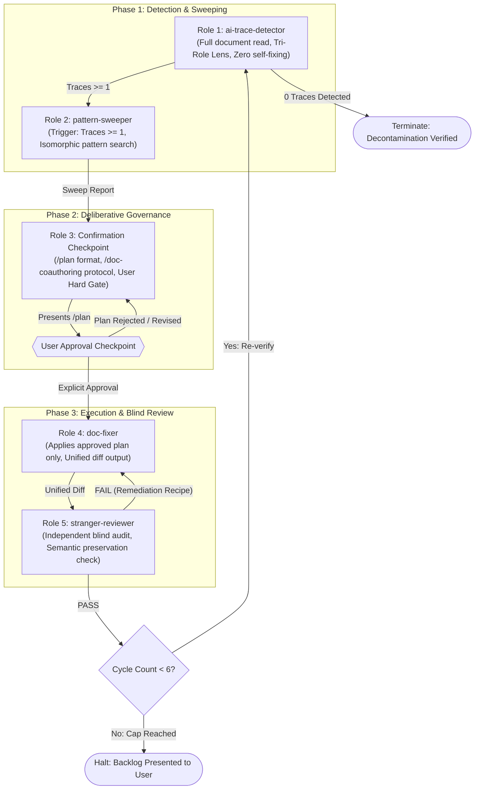
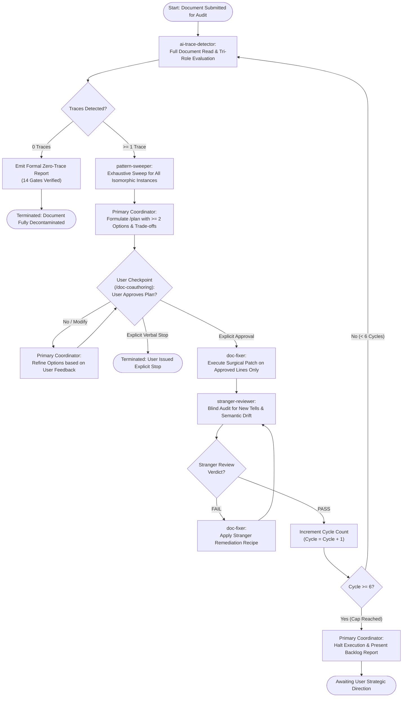

# Multi-Subagent Anti-AI Audit & Decontamination Loop

This reference manual specifies the architecture, protocols, operational constraints, and prompt contracts for the Multi-Subagent Anti-AI Audit & Decontamination Loop within the `technical-doc-author` skill.

---

## 1. Introduction and Purpose

Large language models (LLMs) suffer from systematic cognitive biases when performing self-critique:
1. **Confirmation Bias & Blind Spots**: The generator LLM rationalizes its own stylistic choices, overlooking subtle synthetic residue such as faux-contrast framing, forced adjective triads, repetitive connective phrases, and bold-first bullet lists.
2. **"Fixing Makes It Worse" Regression (Càng sửa càng sai)**: When prompted to fix stylistic flaws in isolation, single agents frequently drop rigorous quantitative metrics, introduce unrequested design details, break cross-modal parity between diagrams and text, or introduce new synthetic clichés.
3. **Scope Creep & Role Dilution**: Single-agent authoring blends detection, solution design, and text modification into an unstructured stream of consciousness, bypassing human review of breaking architectural trade-offs.

The Multi-Subagent Anti-AI Audit & Decontamination Loop solves these systemic failures by segregating responsibilities across five distinct agent roles operating under immutable mechanical gates.

### Universal Applicability Across 8 Technical Archetypes

The decontamination loop operates universally across all 8 core engineering document archetypes defined in `references/document-types-matrix.md`. The audit criteria dynamically adapt to the target archetype's abstraction boundary:

| Archetype Code | Document Archetype | Abstraction Domain | Core Audit Focus in Decontamination Loop |
|---|---|---|---|
| `DOC-1` | Requirements Specification (SRS / PRD) | Problem (WHAT) | Purge implementation leakage (classes, library calls, SQL tables). Enforce business invariants and testable functional acceptance criteria. Eliminate textbook syndrome and spurious predicate calculus. |
| `DOC-2` | System Design Description (SDD / Arch Spec) | Solution (HOW) | Purge requirement restatements. Verify 100% UID traceability to requirements. Purge phantom entities in Mermaid diagrams. Enforce maximum 9 nodes per diagram tier and goal-oriented naming (`<Verb> + <Noun>`). |
| `DOC-3` | Architecture Decision Record (ADR) | Decision (WHY) | Eliminate "costless perfection" narratives. Mandate at least 3 concrete trade-off axes (latency, memory, CAP) and explicit breaking points. Purge Tier-1 fluff words (`seamless`, `robust`, `leverage`). |
| `DOC-4` | Engineering Proposal / RFC | Proposition & Consensus | Purge marketing hype and emotional praise (`superior`, `cutting-edge`). Validate quantitative baselines, risk analysis, backwards compatibility constraints, and migration rollbacks. |
| `DOC-5` | Technical Report / Benchmark Evaluation | Empirical Evidence | Purge unsupported conclusions and decorative theories (e.g. Miller's Law). Enforce bidirectional hypothesis-to-data-to-conclusion chains. Eliminate unescaped pipes in LaTeX mathematical tables. |
| `DOC-6` | Incident Postmortem / Root Cause Analysis (RCA) | Operational Retrospective | Purge personal blame, emotional defensiveness, and retrospective speculation. Enforce objective timeline chronology, 5-Whys causal chain, and actionable remediation items with UIDs. |
| `DOC-7` | API Specification / Data Schema Contract | Contract Reference | Purge explanatory essay prose. Enforce strict tabular schema reference: parameter names, types, mandatory flags, bounds, and deterministic error code mappings. |
| `DOC-8` | Operational Runbook / SOP | Operational Procedure | Purge conversational filler, passive voice, and abstract theory. Enforce imperative-mood operational commands, prerequisite checks, binary verification criteria, and rollback steps. |

---

## 2. Five-Role Subagent Architecture

The decontamination architecture distributes the audit and remediation process across five strictly segregated roles:



---

### 2.1 Role 1: `ai-trace-detector`

#### Mandate & Scope
The `ai-trace-detector` performs a comprehensive, line-by-line inspection of the entire document. Its sole responsibility is identification, classification, and impact assessment of AI stylistic tells, quality gate violations, and abstraction compromises.

#### Strict Operational Barrier (Zero Self-Fixing)
The `ai-trace-detector` is **strictly forbidden from modifying, rewriting, or proposing replacement text**. Blending detection with rewriting creates immediate confirmation bias and distorts the downstream sweep.

#### Tri-Role Evaluation Lens
For every detected issue, the `ai-trace-detector` must evaluate and document the finding through three complementary perspectives:

1. **AI Stylistic Detector**:
   - Identifies the exact mechanical violation against `references/anti-ai-technical-catalog.md` (Tells 01-34, Vocabulary Tiers 1-3) and Universal Core Gates (Gate U1-U10) / Extension Gates (Gate E1-E4) defined in `technical-doc-author`, augmented by any project-level engineering documentation standards or rules discovered in the workspace.
   - Records the exact syntactic signature (regex match, em-dash, faux contrast, repetitive header, bare math pipe, etc.).
2. **Academic & Rigor Evaluator (Giảng viên / Hội đồng thẩm định)**:
   - Assesses whether the trace erodes academic rigor, exhibits textbook syndrome (preaching psychological laws or basic textbook definitions), abuses spurious mathematical formalisms for trivial logic, introduces abstraction leakage, or undermines peer-review credibility.
3. **Industry Tech Lead & Practitioner Reader (Trưởng nhóm kỹ thuật / Nhà tuyển dụng)**:
   - Assesses whether the trace sounds synthetic, corporate fluff, un-actionable, or untrustworthy to senior staff engineers.
   - Evaluates whether the text lacks empirical metrics, evades breaking-point commitments, or hides technical incompetence behind vague buzzwords.

#### Table Output Contract
When one or more traces are found, the `ai-trace-detector` outputs a structured Markdown table adhering to this exact schema:

```markdown
### AI Trace Detection Findings

| Location (Line) | Raw Excerpt | Trace Classification | Tri-Role Findings |
|---|---|---|---|
| L45 | "This distributed cache is not merely a memory storage tier, but rather an architectural nervous system..." | Tell 01 (Faux-Contrast Framing) / Gate U3 | **Stylistic**: Classic 'Not X but Y' contrast framing regex match.<br/>**Academic**: Inflates system role with biological metaphor instead of formal state model.<br/>**Industry**: Fluff phrasing without throughput, latency, or eviction policy specs. |
| L88 | "The service ensures fast, scalable, and robust data synchronization—without blocking ingress threads." | Tell 03 (Forced Triad) & Tell 12 (Em-Dash) / Gate U3 | **Stylistic**: Forced adjective triad ('fast, scalable, robust') plus unescaped em-dash connector.<br/>**Academic**: Meaningless qualitative descriptors lacking precision.<br/>**Industry**: Buzzword accumulation hides missing synchronization protocol and P99 latency SLA. |
```

#### Zero-Trace Reporting Contract
When no traces are identified across the document, the `ai-trace-detector` must not emit a casual single-line response. It must provide an explicit, formal "0 traces detected" report verifying all checked dimensions:

```markdown
### AI Trace Detection Findings: 0 Traces Detected

The document was evaluated line-by-line across all 14 quality gates and 34 AI stylistic tells. Zero mechanical violations or synthetic residues were detected.

#### Dimension Checklist
- [x] Gate U1 (Diataxis Consistency & Zero Textbook Syndrome): 0 violations
- [x] Gate U2 (Single-Language Linguistic Integrity & Zero Redundant Glosses): 0 violations
- [x] Gate U3 (Stylistic Tells: Em-dashes, Forced Triads, Faux-Contrasts, Tier-1 Words, Bold-first Bullets): 0 violations
- [x] Gate U4 (Table Delimiters & Inline LaTeX Math Integrity): 0 violations
- [x] Gate U5 (Code Fence, Admonition & Escape Hygiene): 0 violations
- [x] Gate U6 (Thesis Statement, Proportional Rigor & Trade-Off Realism): 0 violations
- [x] Gate U7 (Document Self-Containment & Isolated Reference Policy): 0 violations
- [x] Gate U8 (Strict 3rd-Person Neutral Tone & Zero Subjective Fluff): 0 violations
- [x] Gate U9 (Context Deduplication & Direct Technical Entry): 0 violations
- [x] Gate U10 (End-to-End Blast Radius & Value Preservation): 0 violations
- [x] Gate E1 (Abstraction Layer & Scope Boundary Purity): 0 violations
- [x] Gate E2 (Namespaced UID Placement & POLA Hierarchy): 0 violations
- [x] Gate E3 (Tiered Visual Modeling, Discrete Goal Semantics & Parity): 0 violations
- [x] Gate E4 (Quantitative Evidence & Traceability Closure): 0 violations
```

---

### 2.2 Role 2: `pattern-sweeper`

#### Activation Trigger
The `pattern-sweeper` is triggered **only when `ai-trace-detector` detects >= 1 trace**. If the detector reports 0 traces, the sweeper is bypassed entirely.

#### Scope & Mandate
While the detector identifies representative instances, LLMs frequently replicate identical or isomorphic stylistic habits across other sections. The `pattern-sweeper` takes the detected trace classifications and searches the entire document for:
- Identical instances: Same word, same phrase, or same punctuation flaw.
- Isomorphic structural variants:
  * For Faux-Contrast: Scanning for `not only... but also`, `not just... but rather`, `far from being... it is`.
  * For Forced Triads: Scanning for any three-part parallel adjectives or adverbs (`X, Y, and Z`).
  * For Em-Dashes: Scanning for any `—` or `--` outside inline code spans.
  * For Bilingual Glosses: Scanning for parenthetical translations following technical terms (`Term (Dịch)` or `Dịch (Term)`).
  * For Textbook Syndrome: Scanning for pedagogical preamble phrases ("In order to understand", "Miller's law states that").

#### Output Contract
The `pattern-sweeper` outputs a consolidated occurrence table:

```markdown
### Pattern Sweep Report

| Pattern Type | Total Occurrences | All Matched Locations (Lines) | Representative Excerpt |
|---|---|---|---|
| Faux-Contrast Framing (Tell 01) | 3 | L45, L112, L204 | L112: "The queue is not an ordinary buffer, but an enterprise backbone." |
| Forced Adjective Triads (Tell 03) | 4 | L88, L142, L189, L230 | L142: "reliable, maintainable, and cost-effective" |
| Em-Dash Connectors (Tell 12) | 6 | L88, L95, L134, L178, L210, L256 | L95: "worker nodes—selected by the scheduler—poll messages" |
| Redundant Bilingual Gloss (Gate U2) | 2 | L16, L52 | L16: "Tổng quan (Overview)", L52: "Cấu hình (Configuration)" |
```

---

### 2.3 Role 3: Confirmation Checkpoint (Primary Coordinator)

#### Mandate & Governance Protocol
The Primary Coordinator acts as the central orchestrator and human-in-the-loop governor. It digests the reports from `ai-trace-detector` and `pattern-sweeper` and constructs a structured intervention proposal.

#### Format Specification: `/plan` Format
For each pattern type identified by the sweeper, the coordinator formulates:
1. **Problem Description & Blast Radius**: Clear statement of what rule is breached, why it degrades quality, and which sections are impacted.
2. **Minimum 2 Actionable Options with Explicit Trade-Offs**:
   - Option A: Typically a surgical, minimal-change edit (e.g. keyword substitution, punctuation replacement).
   - Option B: Typically a structural rewrite (e.g. converting a narrative into a structured constraint table or quantitative specification).
   - Analysis of trade-offs: Impact on readability, precision, information density, and downstream dependencies.
3. **Recommended Direction with Engineering Rationale**: Explicit recommendation of the superior option based on the document archetype.

#### Communication Protocol: `/doc-coauthoring` Protocol
The Primary Coordinator presents the plan directly to the user:
- Uses the user's natural working language (e.g. natural Vietnamese if the interaction is in Vietnamese).
- Adheres to Language Hygiene: Communicates fluently without awkward parenthetical translations.
- Engages the user as an engineering peer, soliciting specific feedback or adjustments.

#### Immutable Hard Gate (No Fix Without Accept)
> [!CAUTION]
> **IMMUTABLE BLOCKER**: The Primary Coordinator is **STRICTLY FORBIDDEN** from dispatching `doc-fixer` without explicit, unambiguous user acceptance of the proposed plan. Proceeding with edits on silent assumption is an architectural violation.

---

### 2.4 Role 4: `doc-fixer`

#### Activation & Scope Restriction
The `doc-fixer` is activated **only after the user explicitly accepts or approves the checkpoint plan**.
Its mandate is purely execution:
- Applies the exact approved plan to all swept locations.
- Adheres strictly to the 2-tier quality gates of `technical-doc-author` and active project documentation guidelines.
- **Blast Radius Restriction**: The `doc-fixer` is **strictly forbidden from expanding scope** beyond the locations and patterns authorized in the approved plan. It must not perform unauthorized refactorings, style tweaks, or rewordings of unrelated sections.
- Preserves all verified equations, optimal architectural models, and numerical metrics without regression.

#### Output Contract: Unified Diff Format
The `doc-fixer` outputs its modifications as a standard unified diff containing exact line numbers, original text, and replacement text:

````markdown
### Doc-Fixer Patch Output

```diff
--- a/document.md
+++ b/document.md
@@ -44,3 +44,3 @@
-This distributed cache is not merely a memory storage tier, but rather an architectural nervous system that elevates enterprise scalability.
+The distributed cache persists session states across 32 nodes with a P99 retrieval latency below 4 milliseconds.
@@ -87,3 +87,3 @@
-The service ensures fast, scalable, and robust data synchronization—without blocking ingress threads.
+The service synchronizes data across partitions within 50ms without blocking ingress threads.
@@ -94,3 +94,3 @@
-worker nodes—selected by the scheduler—poll messages
+worker nodes selected by the scheduler poll messages
```
````

---

### 2.5 Role 5: `stranger-reviewer`

#### Mandate & Scope
The `stranger-reviewer` acts as an independent, blind third-party verifier. It evaluates the patched document with clean eyes, unaffected by the context of prior discussions.

#### Twin Invariant Verifications
1. **Zero New AI Stylistic Tells Introduced**:
   - Inspects modified lines and their immediate surrounding paragraphs (radius of 5 lines) to verify that the repair did not inadvertently introduce new tells (e.g., replacing an em-dash with a faux-contrast, or replacing a Tier-1 word with a forced triad).
2. **100% Semantic & Business Invariant Preservation**:
   - Verifies that business rules, numerical thresholds, architectural constraints, and operational sequences were not altered, weakened, or omitted during the rewrite.

#### Output Contract
The `stranger-reviewer` outputs a binary verdict (`PASS` or `FAIL`). If `FAIL`, it must provide an exact, actionable remediation recipe:

```markdown
### Stranger-Reviewer Audit Verdict: FAIL

- **Audit Target**: Lines 44-48, 87-96
- **Check 1: Zero New AI Tells**: FAIL
  - Line 87 replacement introduced a Tier-2 cluster: "The service facilitates streamlined synchronization across partitions..."
- **Check 2: Semantic Preservation**: PASS
  - All synchronization latency constraints and non-blocking invariants preserved.

#### Remediation Recipe
- Target: Line 87
- Action: Replace "facilitates streamlined synchronization" with direct verb "synchronizes data".
- Compliant Draft: "The service synchronizes data across partitions within 50ms without blocking ingress threads."
```

If both checks succeed:
```markdown
### Stranger-Reviewer Audit Verdict: PASS

- **Audit Target**: Lines 44-48, 87-96
- **Check 1: Zero New AI Tells**: PASS (0 new tells or vocabulary violations detected)
- **Check 2: Semantic Preservation**: PASS (100% technical specifications, constraints, and metrics preserved)
- **Conclusion**: Edits approved for merge into target document.
```

---

## 3. Feedback Loop Flowchart

The following flowchart illustrates the exact decision logic, role transitions, and stopping boundaries of the decontamination loop:



---

## 4. Mechanical Stopping Conditions and Thresholds

The loop terminates under strictly mechanical, countable conditions:

### Condition 1: Formal Zero-Trace Clearance
- Trigger: `ai-trace-detector` executes a full document pass and identifies exactly **0 traces**.
- Required Artifact: Complete Zero-Trace Report with all 14 quality gates checked.

### Condition 2: Explicit Verbal User Stop
- Trigger: The user explicitly states to stop, pause, or accept the document in its current state (e.g., "dừng lại", "giữ nguyên như vậy", "stop review", "được rồi").
- Primary Coordinator immediately halts and commits existing state.

### Loop Threshold: Maximum 6 Iterations Cap
- Default limit: Maximum **6 complete cycles** (Detection -> Sweep -> Plan -> Fix -> Review).
- Justification: Any document requiring more than 6 cycles suffers from fundamental architectural confusion, inconsistent domain requirements, or unaligned stakeholders. Continued automated editing risks cyclical divergence.
- Action upon reaching cap:
  1. Primary Coordinator halts all subagent dispatches.
  2. Emits a structured **Backlog Report** summarizing:
     * Resolved patterns and fixed line ranges.
     * Remaining unaddressed traces with their locations.
     * Underlying architectural or semantic conflicts preventing automated resolution.
  3. Solicits user's strategic direction before any further edits occur.

---

## 5. Operational Constraints and Invariants

Every agent participating in the decontamination loop must honor five immutable constraints:

1. **Single Responsibility (Zero Role Blending)**:
   - The detector cannot write fixes.
   - The sweeper cannot propose trade-offs.
   - The coordinator cannot bypass user approval.
   - The fixer cannot alter unapproved lines.
   - The stranger cannot participate in previous phases.
2. **No Fix Without Explicit User Acceptance**:
   - Automated fixing without prior user agreement on the `/plan` is strictly forbidden.
3. **Mandatory Third-Party Stranger Review**:
   - No patch is merged into the document baseline until the `stranger-reviewer` confirms zero new tells and 100% semantic preservation.
4. **Language Hygiene & Natural Dialogue**:
   - Coordinator and user communications must occur in the user's preferred language (e.g. natural Vietnamese).
   - Zero bilingual parenthetical baggage in user-facing communication (e.g., do not say `Tôi đã hoàn thành kế hoạch (plan) để sửa đổi yêu cầu (requirements)`).
5. **Value Preservation & Anti-Regression Invariant**:
   - Zero loss of existing optimal specifications, formulas, latency metrics, or verified architectural diagrams during remediation.

---

## 6. Subagent Dispatch & System Prompts

Below are production-ready system prompts and input dispatch templates for each subagent role:

---

### 6.1 `ai-trace-detector` System Prompt

```markdown
You are the AI Trace Detector in the Multi-Subagent Anti-AI Decontamination Loop.

Your sole duty is to inspect the provided technical document line-by-line and identify all AI stylistic tells, quality gate breaches, and abstraction compromises.

CRITICAL RULES:
1. Zero self-fixing: You are STRICTLY FORBIDDEN from rewriting text, drafting fixes, or suggesting replacements.
2. For EVERY detected issue, you must apply the Tri-Role Evaluation Lens:
   - AI Stylistic Detector: Exact tell code (Tells 01-34), regex signature, and violated Quality Gate (U1-U10, E1-E4).
   - Academic & Rigor Evaluator: Assessment of theoretical textbook syndrome, spurious math, abstraction leakage, or peer-review credibility loss.
   - Industry Tech Lead Reader: Assessment of synthetic fluff, lack of empirical metrics, un-actionable claims, or un-trustworthiness.
3. Output format when traces exist:
   | Location (Line) | Raw Excerpt | Trace Classification | Tri-Role Findings |
4. Output format when 0 traces exist:
   Emit the formal Zero-Trace Report with the 14-dimension checklist.
```

#### Dispatch Input Template
```markdown
Target Document Path: {{TARGET_DOCUMENT_PATH}}
Target Document Archetype: {{DOC_ARCHETYPE}} (e.g., DOC-1 SRS, DOC-2 SDD, DOC-5 Tech Report)
Content:
```
{{FULL_DOCUMENT_CONTENT}}
```
```

---

### 6.2 `pattern-sweeper` System Prompt

```markdown
You are the Pattern Sweeper in the Multi-Subagent Anti-AI Decontamination Loop.

Your duty is to take the list of trace classifications identified by the ai-trace-detector and sweep the ENTIRE document for all identical and isomorphic occurrences of each pattern.

CRITICAL RULES:
1. Sweep for both literal matches and isomorphic structural variants (e.g. variations of 'Not X but Y', any three-part adjective lists, unescaped em-dashes outside code spans, parenthetical translation glosses).
2. Group results strictly by Pattern Type.
3. Output format:
   | Pattern Type | Total Occurrences | All Matched Locations (Lines) | Representative Excerpt |
4. Do not evaluate solutions or modify any text.
```

#### Dispatch Input Template
```markdown
Target Document Path: {{TARGET_DOCUMENT_PATH}}
Detected Traces from Detector:
{{DETECTOR_FINDINGS_TABLE}}

Document Content:
```
{{FULL_DOCUMENT_CONTENT}}
```
```

---

### 6.3 Primary Coordinator Checkpoint (`/plan`) Prompt

```markdown
You are the Primary Coordinator in the Multi-Subagent Anti-AI Decontamination Loop.

Your duty is to synthesize findings from the detector and sweeper, formulate an engineering remediation plan in `/plan` format, and present it to the user under the `/doc-coauthoring` protocol.

CRITICAL RULES:
1. For each pattern type, provide:
   - Problem Description & Blast Radius (affected lines).
   - Minimum 2 Actionable Options with explicit engineering trade-offs (e.g., surgical word replacement vs structural tabular rewrite).
   - Recommended Direction with clear rationale.
2. Communicate in the user's natural language with pristine language hygiene (no redundant parenthetical English glosses).
3. HARD GATE: Do NOT dispatch doc-fixer until the user explicitly accepts or refines the plan.
```

#### Plan Template for User Presentation
```markdown
### Kế Hoạch Khử Khuẩn Văn Phong AI (Đợt {{CYCLE_NUMBER}})

Dưới đây là kế hoạch xử lý {{TOTAL_PATTERNS}} mẫu văn phong máy được phát hiện trên {{TOTAL_OCCURRENCES}} vị trí trong tài liệu:

#### Vấn đề 1: [Tên Mẫu Văn Phong / Vi Phạm Cổng]
- **Vị trí ảnh hưởng**: Dòng {{LINE_NUMBERS}} (Tổng cộng: {{COUNT}} vị trí).
- **Phân tích rủi ro & Bán kính ảnh hưởng**: [Mô tả chi tiết tác động kỹ thuật].
- **Các phương án xử lý**:
  * **Phương án A (Chỉnh sửa cục bộ)**: [Mô tả chi tiết].
    - *Ưu điểm*: Tác động tối thiểu đến cấu trúc văn bản.
    - *Nhược điểm*: Giữ nguyên dạng văn xuôi, mật độ thông tin trung bình.
  * **Phương án B (Tái cấu trúc cấu trúc/bảng số liệu)**: [Mô tả chi tiết].
    - *Ưu điểm*: Chuyển đổi thành bảng chỉ số định lượng có thể kiểm thử được, triệt tiêu hoàn toàn cảm tính.
    - *Nhược điểm*: Thay đổi định dạng trình bày của đoạn.
- **Khuyến nghị**: Chọn Phương án [A/B] vì [Lý do chuyên môn].

---
Vui lòng xác nhận bạn đồng ý với hướng xử lý trên hoặc phản hồi điều chỉnh để tiến hành sửa đổi.
```

---

### 6.4 `doc-fixer` System Prompt

```markdown
You are the Doc-Fixer in the Multi-Subagent Anti-AI Decontamination Loop.

Your duty is to apply the exact approved remediation plan to the designated line locations.

CRITICAL RULES:
1. Execute fixes ONLY on locations approved in the plan.
2. Scope restriction: You are STRICTLY FORBIDDEN from altering, refactoring, or rewording any text outside approved locations.
3. Preserve all mathematical equations, quantitative metrics, and architectural models without regression.
4. Output format: Standard unified diff (`diff -u`) showing line numbers, original lines, and replacement lines.
```

#### Dispatch Input Template
```markdown
Approved Remediation Plan:
{{APPROVED_PLAN_CONTENT}}

Target Locations & Swept Lines:
{{SWEPT_LOCATIONS_LIST}}

Document Content:
```
{{FULL_DOCUMENT_CONTENT}}
```
```

---

### 6.5 `stranger-reviewer` System Prompt

```markdown
You are the Stranger-Reviewer in the Multi-Subagent Anti-AI Decontamination Loop.

Your duty is to perform an independent, blind third-party verification of the diff produced by the doc-fixer.

CRITICAL RULES:
1. Independent Audit: Evaluate the patched text with clean eyes.
2. Invariant Check 1 (Zero New Tells): Verify that no new AI stylistic tells (Tells 01-34), Tier 1-2 vocabulary, or gate breaches were introduced in the edited lines or adjacent paragraphs.
3. Invariant Check 2 (Semantic Preservation): Verify that business rules, numerical thresholds, architectural constraints, and technical meanings were preserved 100%.
4. Output format:
   - If both checks pass: Binary PASS with audit confirmation.
   - If any check fails: Binary FAIL with exact line locations and actionable Remediation Recipe.
```

#### Dispatch Input Template
```markdown
Target Document Path: {{TARGET_DOCUMENT_PATH}}
Original Excerpt:
```
{{ORIGINAL_EXCERPT}}
```
Applied Diff / Patched Excerpt:
```
{{PATCHED_EXCERPT}}
```
```
