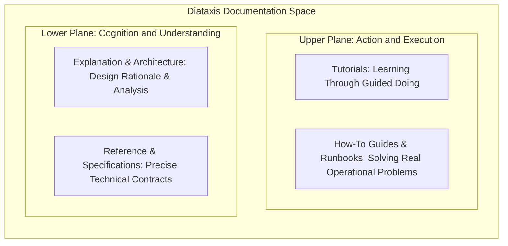
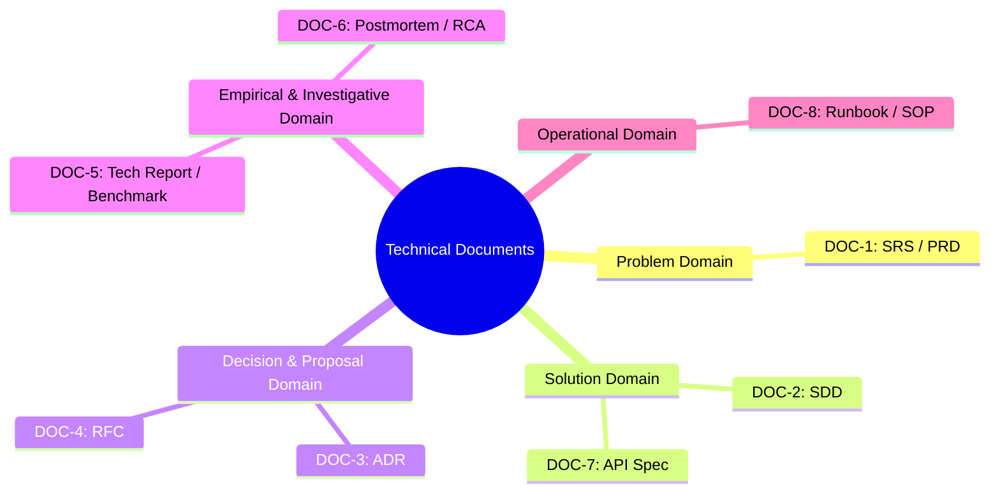
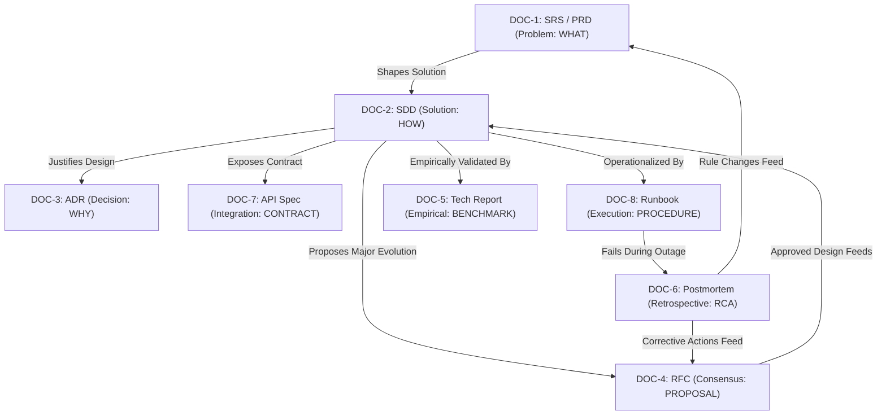

# Document Types Matrix & Diataxis Architectural Blueprint

This reference defines the classification matrix, information domain boundaries, Diataxis structural framework, and standardized blueprints for 8 core industrial technical document types. Its primary purpose is to establish strict technical separation among problem, solution, decision, proposal, evaluation, postmortem, data contract, and procedural operational domains, eliminating phase leakage and enforcing mechanical documentation quality standards across engineering disciplines.

---

## 1. The Diataxis Documentation Framework

### 1.1 The Two Fundamental Axes

The Diataxis framework, formulated by Daniele Procida, categorizes all technical documentation along two independent axes:

1. **Horizontal Axis: Learning (Acquisition) versus Practical Work (Application)**  
   This axis reflects the reader's operational state. On the left, the reader acquires new mental models, explores foundational concepts, and builds comprehension. On the right, the reader executes production tasks, resolves specific technical bottlenecks, implements software systems, or mitigates outages.

2. **Vertical Axis: Practical Execution (Action) versus Theoretical Understanding (Cognition)**  
   This axis reflects the primary nature of the text. On the upper half, the documentation guides the reader through a concrete sequence of physical actions. On the lower half, the documentation provides reference information or theoretical explanations to assist analytical thinking and architectural decision-making.

The intersection of these two axes forms four distinct quadrants:
1. **Tutorials**: Intersection of Learning and Action.
2. **How-to Guides / Runbooks**: Intersection of Practical Work and Action.
3. **Reference / Specifications**: Intersection of Practical Work and Cognition.
4. **Explanation / Architecture**: Intersection of Learning and Cognition.



### 1.2 Four Quadrants Comparison Matrix

| Quadrant | Tutorials | How-To Guides / Runbooks | Reference / Specifications | Explanation / Architecture |
|---|---|---|---|---|
| **Coordinate Axes** | Learning x Action | Practical Work x Action | Practical Work x Cognition | Learning x Cognition |
| **Core Focus** | Guided hands-on learning | Solving specific operational problems | Authoritative technical facts | System context and design rationale |
| **Technical Objective** | Guide a beginner through an unbroken sequence of steps from start to working result | Provide step-by-step instructions to complete a real-world task in production | Provide complete, exact specifications of parameters, schemas, metrics, and endpoints | Clarify architectural trade-offs, technology choices, experimental conclusions, and system interactions |
| **Reader Assumption** | No prior system knowledge; requires a predictable sandbox environment | Understands basic concepts; needs immediate steps to achieve a concrete goal | Actively writing code or operating systems; needs exact types, schemas, and return codes | Evaluating architecture or results; requires deep design rationale and empirical trade-off data |
| **Writing Tone** | Instructive, supportive; explains immediate results after each step | Direct, imperative; emphasizes executable commands and verified outcomes | Neutral, terse, objective; zero conversational filler or editorial opinion | Analytical, expository; connects engineering history, constraints, benchmarks, and trade-offs |
| **Typical Formats** | Getting started guides, onboarding walkthroughs | Incident runbooks, disaster recovery SOPs, deployment procedures | OpenAPI schemas, SRS requirements, configuration dictionaries, benchmark metrics | System design descriptions (SDD), ADRs, RFC proposals, postmortem RCAs, benchmark reports |
| **Acceptance Metric** | 100% of readers achieve identical sample output; branching conditions equal 0 | 100% of steps have verification checks; recovery/completion time within target SLO | 100% of parameters specify types, valid ranges, and error conditions | Analyzes at least 3 concrete trade-off axes; specifies breaking points and empirical limits |

### 1.3 Boundary Isolation Discipline

Blending multiple quadrants within a single section confuses reader cognition and degrades documentation utility. Four isolation rules are mandatory:

1. **Never Embed Reference Schemas Inside Tutorials**:
   Tutorials must remain an unbroken narrative thread. Inserting full API error tables or exhaustive configuration dictionaries into a getting-started guide interrupts hands-on execution. Place complete schemas in Reference documents and provide hyperlinks.

2. **Never Embed Pedagogical Lessons Inside How-To Guides or Runbooks**:
   Engineers consulting a runbook during a production incident need actionable commands. Do not include theoretical background or historical context in operational procedures.

3. **Keep Reference Documents Free of Procedural Narratives**:
   Reference manuals must remain strictly objective, indexed, and descriptive. Do not insert multi-step narrative walkthroughs inside API endpoint reference sections or requirements tables.

4. **Confine Architectural Debates to Explanation Documents**:
   Keep theoretical discussions of alternative database engines, consensus algorithms, and historical refactoring decisions out of daily operator how-to guides and API references. Confine architectural analysis to Explanations, SDDs, ADRs, and RFCs.

---

## 2. The Eight Core Industrial Technical Document Types



### 2.1 DOC-1: Software Requirements Specification (SRS / PRD - ISO/IEC/IEEE 29148)

- **Information Domain**: Problem Domain (`WHAT`).
- **Primary Audience**: Product Managers, Software Architects, QA Engineers, Business Stakeholders.
- **Diataxis Quadrant**: Reference / Explanation (Requirements Domain).
- **Scope & Boundaries**: Defines the problem space, business goals, user personas, system boundaries, and verifiable functional/non-functional requirements. Specifies what the system must accomplish from the perspective of external actors and business stakeholders without prescribing code implementation.
- **Strict Prohibitions**:
  - Zero OOA/OOD design patterns (Factory, Singleton, Strategy, Observer).
  - Zero code implementation constructs: Service Layer, Controller, Repository, DAO, DTO, or Entity.
  - Zero database-specific schemas, indexing strategies, or foreign key column constraints.
  - Zero programming-language-specific constructs: forbid naming specific library methods (e.g., `BigDecimal.add()`), language types, or source-code exception class names (e.g., `SameWalletTransferException`).
  - Zero spurious mathematical formalisms (Academic Overkill): forbid predicate logic ($\forall, \exists, \exists!$) or trivial cancellation algebra for routine CRUD rules.
  - Zero flat non-namespaced UIDs: forbid flat identifiers (`UC01`, `FR01`); require hierarchical domain namespaces (`UC-WAL-01`, `FR-AUTH-01`).
  - Zero "CRUD / God Use Cases": forbid naming use cases with generic "Manage [Entity]" / "Quản lý [Thực thể]" bundles; require atomic User Goals (`<Active Verb> + <Direct Object>`).
  - Zero alternative flows acting as navigation menus to jump to other screens.
  - Zero phantom use cases in diagrams lacking matching textual specifications.
- **Core Sections**:
  1. Product Purpose, Vision & System Context
  2. External System Actors & User Personas
  3. Immutable Business Rules (`BR-[DOMAIN]-[NN]`)
  4. Functional Requirements (`FR-[SUBSYS]-[NN]`)
  5. Goal-Oriented Use Case Specifications (`UC-[SUBSYS]-[NN]`)
  6. Non-Functional Quantitative Requirements (`NFR-[SUBSYS]-[NN]`)

### 2.2 DOC-2: Software Design Description (SDD - IEEE 1016)

- **Information Domain**: Solution Domain (`HOW`).
- **Primary Audience**: Software Engineers, Infrastructure Engineers, Systems Architects.
- **Diataxis Quadrant**: Explanation / Reference (Architecture Domain).
- **Scope & Boundaries**: Defines the technical solution, component topology, deployment containers, communication protocols, persistent data schemas, internal algorithms, and system breaking points.
- **Strict Prohibitions**:
  - Never rewrite complete business rule narratives or user stories from the SRS; cite upstream requirement identifiers (`FR-xxx`, `BR-xxx`).
  - Never claim universal scalability or performance without documenting concrete trade-offs and breaking point capacity limits.
- **Core Sections**:
  1. Architectural Thesis, System Context & Design Constraints
  2. Container Topology & Subsystem Decomposition (C4 Tier 1 & Tier 2)
  3. Interface Contracts & Inter-Service Communication Protocols
  4. Persistent Data Models & Storage Partitioning Strategies
  5. Requirement Traceability Matrix (Mapping `FR-xxx` to Components)
  6. System Breaking Point, Resource Saturation & Capacity Limits

### 2.3 DOC-3: Architectural Decision Record (ADR - MADR / Michael Nygard)

- **Information Domain**: Decision Domain (`WHY`).
- **Primary Audience**: Architecture Review Boards, Engineering Teams, Future Maintainers.
- **Diataxis Quadrant**: Explanation (Decision History).
- **Scope & Boundaries**: Captures a single significant architectural or design decision, describing the operational context, evaluated alternatives, decision drivers, chosen strategy, and resulting engineering trade-offs.
- **Strict Prohibitions**:
  - Do not convert ADRs into procedural step-by-step tutorials or installation guides.
  - Never document a selected architecture without detailing discarded alternatives and their explicit disqualification criteria.
  - Never omit negative consequences or operational liabilities introduced by the decision.
- **Core Sections**:
  1. Status (Draft, Proposed, Accepted, Deprecated, Superseded)
  2. Operational Context & Technical Problem Statement
  3. Decision Drivers (Latency, cost, compliance, team capability, resilience)
  4. Evaluated Options & Comparative Multi-Criteria Trade-Off Matrix
  5. Decision Outcome & Justification
  6. Concrete Consequences (Positive, Negative, and Neutral Operational Realities)

### 2.4 DOC-4: Request for Comments / Engineering Proposal (RFC - IETF Style)

- **Information Domain**: Proposal & Consensus Domain (`PROPOSAL`).
- **Primary Audience**: Technical Leads, Cross-Functional Engineering Teams, Security & Ops Stakeholders.
- **Diataxis Quadrant**: Explanation / Proposal.
- **Scope & Boundaries**: Proposes a substantial technical change, new platform subsystem, protocol standard, or cross-cutting architectural evolution before implementation begins. Gathers organizational consensus, identifies edge-case risks, and defines migration strategies.
- **Strict Prohibitions**:
  - Never propose an architecture without at least two rejected alternative designs and explicit rationale.
  - Never omit backward compatibility analysis or rollout/migration phases.
  - Never hide unresolved architectural open questions or technical ambiguities under generic phrases.
- **Core Sections**:
  1. Summary & Motivation (Problem Statement & Business Justification)
  2. High-Level Technical Design & Proposed Protocol/Interface Changes
  3. Multi-Phase Implementation Plan & Work Breakdown
  4. Migration, Compatibility & Deprecation Strategy
  5. Security, Privacy & Operational Resilience Considerations
  6. Evaluated Alternative Approaches & Disqualification Rationale
  7. Unresolved Open Questions & Review Decisions

### 2.5 DOC-5: Technical Report & Benchmark Evaluation (ISO/IEC/IEEE 15289)

- **Information Domain**: Empirical & Experimental Domain (`EVALUATION`).
- **Primary Audience**: Performance Engineers, Systems Architects, Technical Leadership.
- **Diataxis Quadrant**: Reference / Explanation (Empirical Facts).
- **Scope & Boundaries**: Documents reproducible empirical findings, load testing, benchmark evaluations, capacity planning investigations, or hardware/software feasibility studies. Delivers measured facts, environment specifications, and statistical conclusions.
- **Strict Prohibitions**:
  - Never report benchmark numbers without specifying exact hardware, OS, network, workload parameters, and reproducible harness configurations.
  - Never report sole mean/average values without percentiles (P50, P95, P99) and variance/confidence intervals.
  - Never make subjective claims ("superior", "faster") without direct reference to tabular empirical data.
- **Core Sections**:
  1. Executive Summary & Experimental Objectives
  2. Test Environment Specification (Hardware, Kernel, Software, Network Topology)
  3. Methodology, Workload Profiling & Load Generation Harness
  4. Quantitative Results & Percentile Distributions (Tables & Charts)
  5. Resource Saturation Analysis (CPU, Memory, Disk I/O, Network Bandwidth)
  6. Empirical Limitations, Anomaly Observations & Architectural Recommendations

### 2.6 DOC-6: Incident Postmortem & Root Cause Analysis (Postmortem / RCA - SRE)

- **Information Domain**: Investigative & Remediation Domain (`POSTMORTEM`).
- **Primary Audience**: Engineering Leadership, Site Reliability Engineers, Product Stakeholders.
- **Diataxis Quadrant**: Explanation / Reference (Operational Incident Analysis).
- **Scope & Boundaries**: Provides a blameless, rigorous retrospective analysis of a production outage, data loss event, or service degradation. Establishes the exact timeline, primary root cause, contributing systemic factors, and preventative action items.
- **Strict Prohibitions**:
  - Zero personal blame ("human error", "operator mistake"); focus strictly on systemic safeguards, automated guardrails, and architectural deficiencies.
  - Never omit an exact chronological timeline with coordinated UTC timestamps.
  - Never leave preventative action items without a direct owner, priority, and tracking ticket identifier.
- **Core Sections**:
  1. Incident Metadata (Severity, Start/End UTC, Total Downtime, User Impact SLA/SLO)
  2. Incident Summary & User-Facing Impact Assessment
  3. Chronological Incident Timeline (UTC timestamps: Trigger, Detection, Escalation, Mitigation, Resolution)
  4. Root Cause Analysis (5-Whys Chain & Fault Propagation Flowchart)
  5. Systemic Contributing Factors & Trigger Mechanisms
  6. What Went Well, What Went Poorly & Where We Got Lucky
  7. Preventative & Corrective Action Items Matrix (Owner, Priority, Target Date, Tracking Ticket)

### 2.7 DOC-7: Interface and Data Contract Specifications (API Spec - OpenAPI 3.1)

- **Information Domain**: Integration Domain (`DATA CONTRACT`).
- **Primary Audience**: API Consumers, Backend Engineers, Frontend Engineers, Third-Party Integrators.
- **Diataxis Quadrant**: Reference (Precise Information Lookup).
- **Scope & Boundaries**: Defines the external interface contract between distributed systems. Specifies endpoints, HTTP methods, transport protocols (REST/gRPC), request parameters, response schemas, and structured error formats.
- **Strict Prohibitions**:
  - Forbid untyped JSON payloads (every field must specify explicit data types and boundary constraints).
  - Forbid arbitrary non-standard error responses; require standardized schemas (e.g., RFC 7807 Problem Details or gRPC Status Codes).
  - Forbid undocumented status codes or unhandled edge cases.
- **Core Sections**:
  1. Endpoint URI, Protocol, Transport & HTTP Method
  2. Authentication, Scopes & Authorization Roles
  3. Request Headers, Path Parameters & Query Parameters
  4. Request Body Schema with Explicit Validation Invariants
  5. Response Codes & Payloads (Success 2xx, Client Errors 4xx, Server Errors 5xx)
  6. Concrete Request and Response Payload Examples (Success and RFC 7807 Failures)

### 2.8 DOC-8: Operational Runbooks & Standard Operating Procedures (SRE Runbook / SOP)

- **Information Domain**: Operational Domain (`PROCEDURE`).
- **Primary Audience**: On-Call Engineers, SREs, Systems Administrators.
- **Diataxis Quadrant**: How-to Guide (Action & Execution).
- **Scope & Boundaries**: Provides deterministic, reproducible, step-by-step procedures for system maintenance, deployment, failover, backup, disaster recovery, and incident remediation under operational pressure.
- **Strict Prohibitions**:
  - Never present an operational command without an immediate verification check and expected stdout/stderr output.
  - Never write destructive operations without an explicit rollback procedure and safety check.
  - Never include long theoretical essays or architectural debates.
- **Core Sections**:
  1. Incident Symptoms, Alert Name & Trigger Thresholds
  2. Environmental Prerequisites, Access Privileges & CLI Tooling Requirements
  3. Step-by-Step Executable Command Sequence
  4. Verification Check and Expected Output per Step
  5. Deterministic Rollback Procedure for Operational Failures
  6. Escalation Paths, On-Call Roster & Communication Channels

---

## 3. Structural Outlines and Blueprints

### 3.1 Software Requirements Specification (SRS / PRD) Blueprint

```markdown
# Software Requirements Specification: [System / Subsystem Name]

## 1. Product Context & Objectives
### 1.1 Business Purpose & Value Drivers
### 1.2 System Boundary & Out-of-Scope Declarations
### 1.3 External Actors & User Personas

## 2. Business Rules & Invariants
### 2.1 BR-[DOMAIN]-01: [Rule Name]
### 2.2 BR-[DOMAIN]-02: [Rule Name]

## 3. Functional Requirements
### 3.1 FR-[SUBSYS]-01: [Requirement Name]
### 3.2 FR-[SUBSYS]-02: [Requirement Name]

## 4. Goal-Oriented Use Case Specifications
### 4.1 UC-[SUBSYS]-01: [Active Verb + Direct Object]
- Actor:
- Preconditions:
- Trigger:
- Main Success Flow:
  1. Actor submits...
  2. System validates...
  3. System persists...
- Alternative / Exception Flows:
  - 2a. Validation fails: System returns...
- Postconditions:

## 5. Non-Functional Quantitative Requirements
### 5.1 NFR-PERF-01: [Latency / Throughput Threshold]
### 5.2 NFR-SEC-01: [Encryption / Auth Invariant]
```

### 3.2 Software Design Description (SDD) Blueprint

```markdown
# Software Design Description: [System / Subsystem Name]

## 1. Architectural Thesis & Constraints
### 1.1 Problem Statement & Thesis
### 1.2 Architectural Constraints & Workload Envelope

## 2. System Architecture & Container Topology
### 2.1 Context Overview (C4 Level 1)
### 2.2 Container Decomposition (C4 Level 2)

## 3. Component Design & Dynamic Interactions
### 3.1 Ingestion Service Architecture
### 3.2 State Persistence Engine

## 4. Data Storage & Schema Design
### 4.1 Relational Schema & Partitioning Strategy
### 4.2 Caching Strategy & Eviction Invariants

## 5. System Breaking Point & Capacity Limits
### 5.1 Maximum Sustainable Throughput
### 5.2 Failure Modes at Resource Saturation
```

### 3.3 Architectural Decision Record (ADR) Blueprint

```markdown
# ADR-[NNNN]: [Short Decision Title]

## Status
[Proposed | Accepted | Deprecated | Superseded by ADR-XXXX]

## Context & Problem Statement
[Describe the technical context, environmental constraints, and specific architectural challenge.]

## Decision Drivers
- Latency threshold (< 10ms P99)
- Infrastructure operational cost budget
- Team operational familiarity

## Considered Options
1. Option A: [Description]
2. Option B: [Description]
3. Option C: [Description]

## Multi-Criteria Decision Matrix
| Evaluation Criteria | Option A | Option B | Option C |
|---|---|---|---|
| P99 Retrieval Latency | 3.2 ms | 12.5 ms | 28.0 ms |
| Storage Operational Cost | High ($1.2k/mo) | Low ($250/mo) | Moderate ($600/mo) |
| Operational Complexity | Minimal | High | Moderate |

## Decision Outcome
Chosen Option: [Option A], because [clear technical rationale based on decision drivers].

## Consequences & Trade-Offs
- Positive: [Guaranteed latency under peak load]
- Negative: [Increased memory consumption requiring strict eviction monitoring]
- Neutral: [Requires introducing a new Redis Sentinel cluster]
```

### 3.4 Request for Comments (RFC) Blueprint

```markdown
# RFC-[NNNN]: [Proposed Technical Feature / Architectural Evolution]

## 1. Summary & Motivation
### 1.1 Executive Summary
### 1.2 Motivation & Current Pain Points

## 2. Proposed Technical Design
### 2.1 Architectural Overview & System Impact
### 2.2 Interface Contracts & Protocol Specifications
### 2.3 Data Storage & Migration Strategy

## 3. Multi-Phase Implementation Plan
### 3.1 Phase 1: Prototype & Dark Launch
### 3.2 Phase 2: Canary Deployment (5% Traffic)
### 3.3 Phase 3: Full Production Migration & Deprecation

## 4. Operational & Security Considerations
### 4.1 Observability, Metrics & Alerting
### 4.2 Security Threat Analysis & Mitigation

## 5. Alternative Designs Considered
### 5.1 Rejected Alternative A & Disqualification Criteria
### 5.2 Rejected Alternative B & Disqualification Criteria

## 6. Open Questions & Unresolved Decisions
- [ ] Question 1: [Specific technical uncertainty]
- [ ] Question 2: [Hardware allocation constraint]
```

### 3.5 Technical Report & Benchmark Evaluation Blueprint

```markdown
# Technical Report: [System / Subsystem Performance & Benchmark Evaluation]

## 1. Executive Summary & Objectives
### 1.1 Objective of Evaluation
### 1.2 Key Findings Summary Table

## 2. Test Environment & Harness Specification
### 2.1 Hardware, Kernel & OS Parameters
### 2.2 Network Topology & Bandwidth Capacity
### 2.3 Software Versions & Deployment Topology

## 3. Benchmark Methodology & Workload Profile
### 3.1 Test Scenarios & Synthetic Traffic Profiles
### 3.2 Measurement Tools & Telemetry Instrumentation

## 4. Quantitative Results & Percentile Distributions
### 4.1 Throughput vs Latency Profile (RPS, P50, P95, P99)
| Concurrency (Threads) | Target RPS | Achieved RPS | P50 (ms) | P95 (ms) | P99 (ms) | Error Rate (%) |
|---|---|---|---|---|---|---|
| 50 | 5,000 | 4,998 | 1.8 | 4.2 | 8.5 | 0.00% |
| 200 | 20,000 | 19,840 | 3.5 | 9.1 | 18.2 | 0.02% |
| 500 | 50,000 | 34,200 | 18.4 | 82.0 | 240.0 | 4.15% |

### 4.2 Resource Saturation Profiling (CPU, Memory, Disk IOPS)

## 5. Engineering Analysis & Recommendations
### 5.1 System Breaking Point & Bottleneck Identification
### 5.2 Architectural Tuning Recommendations
```

### 3.6 Incident Postmortem / Root Cause Analysis Blueprint

```markdown
# Incident Postmortem: [Date] - [Outage Summary Name]

## 1. Incident Metadata
- Severity: SEV-1
- Incident Date: YYYY-MM-DD
- Incident Duration: 1h 42m (14:10 UTC - 15:52 UTC)
- Impact: 14,200 payment transactions rejected (2.4% daily volume)
- Incident Commander: [Name / Role]

## 2. User-Facing Impact & SLA Assessment
[Detailed impact description including error rates, degraded customer journeys, and SLA penalty implications.]

## 3. Chronological Incident Timeline (UTC)
- 14:10 UTC: Deployment v2.14.0 promoted to 100% production traffic.
- 14:15 UTC: Ingestion P99 latency alerts fire (Threshold > 500ms).
- 14:22 UTC: On-call engineer pages Incident Commander; triage initiated.
- 14:38 UTC: Root cause identified as connection pool starvation in Auth Proxy.
- 14:45 UTC: Rollback initiated to v2.13.9 via canary pipeline.
- 15:52 UTC: All connection pools normalized; error rates return to 0.00%.

## 4. Root Cause Analysis (5-Whys)
1. Why did payment requests fail? Database connection pools were completely exhausted.
2. Why were connection pools exhausted? Auth Proxy held open synchronous connections during slow external token lookups.
3. Why did external token lookups slow down? Third-party identity provider experienced packet drop.
4. Why did slow third-party calls block the main pool? Connection timeouts were set to 30 seconds with no circuit breaker.
5. Why were timeouts set to 30s without circuit breaking? Default client library configuration was deployed without resilience testing.

## 5. What Went Well, What Went Poorly & Luck Factors
- Went Well: Automated rollback script executed cleanly without data corruption.
- Went Poorly: Alert threshold took 7 minutes to page on-call due to noisy alert grouping.
- Luck: Incident occurred during low-traffic window, avoiding complete upstream queue overflow.

## 6. Corrective & Preventative Action Items
| Action Item | Type | Priority | Owner | Target Date | Tracking Ticket |
|---|---|---|---|---|---|
| Configure 2s timeout and circuit breaker on Auth Proxy | Prevent | P0 | NetSec Team | YYYY-MM-DD | SEC-402 |
| Decouple alert notification from composite cluster metric | Detect | P1 | SRE Team | YYYY-MM-DD | SRE-891 |
| Conduct chaos test for third-party token service latency | Mitigate | P2 | QA Team | YYYY-MM-DD | QA-105 |
```

### 3.7 Requirement Traceability Matrix (RTM) Template

All engineering specifications (DOC-1, DOC-2, DOC-7) must maintain bidirectional traceability linking business rules down to automated test cases:

| Goal ID | Business Rule | Functional Requirement | Use Case ID | Component Module | Automated Test Case | Status |
|---|---|---|---|---|---|---|
| BG-01 | BR-FIN-01 | FR-ORD-01 | UC-ORD-01 | PaymentGatewayProxy | `test_idempotent_order_settlement` | PASS |
| BG-01 | BR-FIN-02 | FR-ORD-02 | UC-ORD-02 | LedgerPersistenceService | `test_ledger_daily_balance_invariant` | PASS |
| BG-02 | BR-AUTH-01 | FR-AUTH-01 | UC-AUTH-01 | SecurityTokenValidator | `test_fido2_signature_verification` | PASS |
| BG-03 | BR-INV-01 | FR-INV-01 | UC-INV-01 | InventoryReservationEngine | `test_concurrent_stock_allocation` | PASS |
| BG-03 | BR-INV-02 | FR-INV-02 | UC-INV-02 | DispatchQueueWorker | `test_dead_letter_queue_redelivery` | PASS |

### 3.8 Multi-Criteria Architectural Trade-Off Analysis Matrix Template

Mandatory for SDD (DOC-2), ADR (DOC-3), and RFC (DOC-4) documents to document engineering compromises:

| Design Dimension | Evaluated Option A | Evaluated Option B | Selected Option | Primary Trade-Off Justification |
|---|---|---|---|---|
| State Storage | Distributed In-Memory Cache (Redis) | Relational Storage (PostgreSQL) | Option A | Accepts volatile crash recovery overhead in exchange for sub-5ms read latency. |
| Message Ingestion | Pull-Based Long Polling | Push-Based Webhooks | Option B | Eliminates empty query bandwidth consumption at the cost of requiring tenant endpoint health tracking. |
| Data Consistency | Strong Synchronous Replication | Eventual Asynchronous Replication | Option B | Maximizes availability across availability zones during partition events, trading immediate read freshness. |
| RPC Transport | REST JSON over HTTP/1.1 | Protocol Buffers over gRPC (HTTP/2) | Option B | Sacrifices human readability in network packet inspections to achieve a 60 percent payload size reduction. |

---

## 4. Cross-Linking, Transmutation Rules & Diataxis Lifecycle

### 4.1 Lifecycle Relationship Graph Between Artifacts

Technical documents interact across the entire engineering lifecycle:



### 4.2 Cross-Referencing Discipline

1. **Zero Redundant Copying**:
   When an SDD references a business invariant or an API schema references a domain rule, cite the unique identifier (such as `BR-FIN-01` or `FR-ORD-02`). Do not copy the full narrative text from the SRS.

2. **Backward Traceability**:
   Every design component in an SDD, every endpoint in an API Spec, and every proposed change in an RFC must cite the upstream requirement identifier it implements. Artifacts lacking upstream justification are classified as architectural bloat.

3. **Closed-Loop Remediation**:
   Every corrective action item in a Postmortem (DOC-6) must result in a tracked issue that updates either the system requirements (DOC-1), the architectural safeguards (DOC-2), or the operational runbooks (DOC-8).

4. **Document Self-Containment & Zero Unsolicited External Referencing**:
   Every technical engineering document must be self-contained within its declared scope and abstraction level. Authors must never deflect specification responsibilities by referring to unprovided external documents in the body of the text (e.g., "see detailed database design in Document X"). Cross-document references are permitted ONLY when explicitly requested by the user or required by standardized formal templates (such as IEEE SRS References). When permitted, all external citations must be isolated 100% within a dedicated `## References` or `## Tài liệu tham khảo` section. Unrequested external document mentions in body text must equal 0.

5. **Context Deduplication Across Hierarchical Sections**:
   Sub-sections within a document automatically inherit the high-level system context established in parent sections. Authors must never repeat high-level project goals, business problem narratives, or system definitions in the opening sentences of sub-sections. Every sub-section must enter directly with local technical facts, entities, parameters, or schema constraints.

6. **Global Consistency & Value Preservation during Evolution**:
   When editing, updating, or refactoring existing technical documentation, authors must perform an end-to-end blast radius analysis across the document lifecycle. Edits must never degrade previously established high-rigor specifications, detailed numerical metrics, or verified architectural diagrams to resolve a narrow localized feedback item ("càng sửa càng sai"). Retain all optimal, compliant content and surgically update only invalid or outdated sections. If proposed modifications carry cascading risks or require breaking architectural compromises, summarize the blast radius and align the proposed resolution with stakeholders/users prior to modifying the document.

