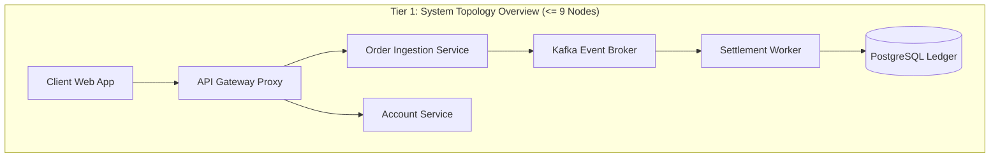
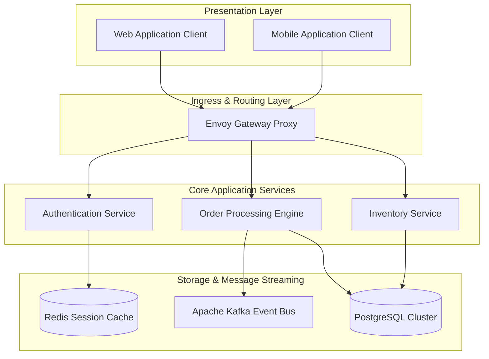
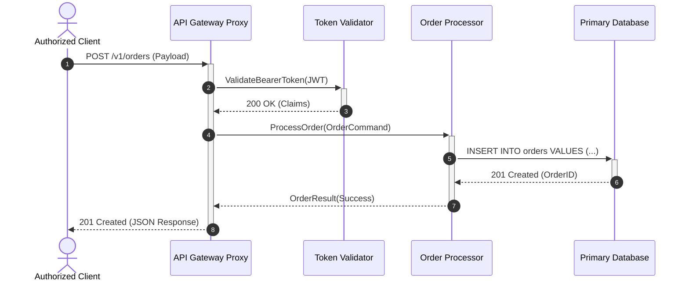
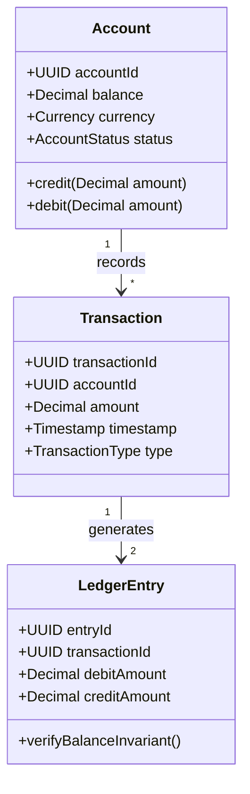
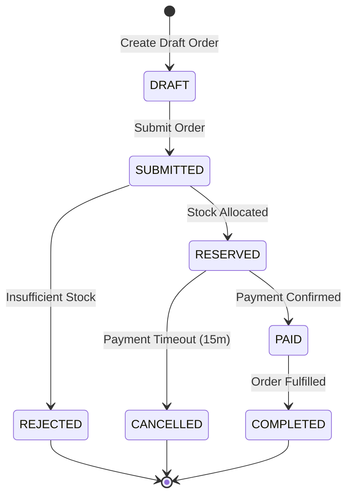
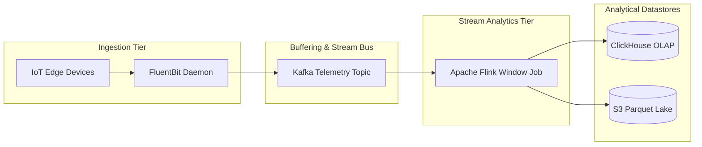
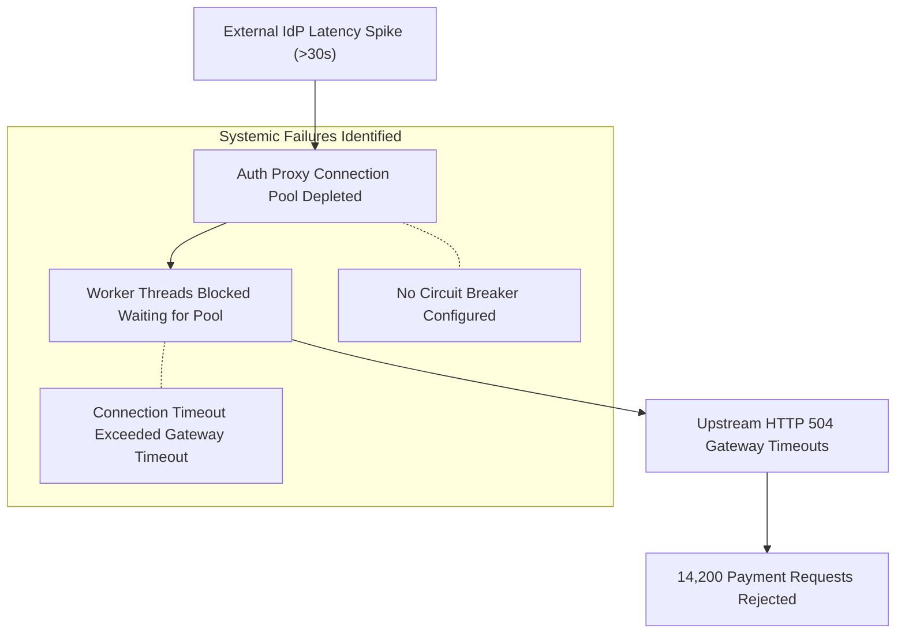

# Universal Visual Modeling & Diagramming Guide

This guide establishes visual modeling and architectural diagramming standards for technical engineering documentation across the repository. It combines the agile modeling principles of Scott W. Ambler, the hierarchical abstractions of the C4 model by Simon Brown, and open source Mermaid diagram specifications. Every rule operates on countable thresholds, semantic integrity checks, and verifiable pass/fail criteria.

---

## 1. Scott W. Ambler Philosophy & The C4 Model

### 1.1 Five Core Principles of Agile Modeling

Agile modeling, formulated by Scott W. Ambler, focuses on creating high-value architectural models while minimizing documentation maintenance overhead:

1. **Model with Clear Purpose**:
   Every diagram must answer a specific technical question or resolve cognitive ambiguity for readers. Before drawing, the author must identify the intended audience and the technical decision or system invariant being verified. Diagrams lacking an explicit verification purpose must be omitted.

2. **Employ Multiple Models in Parallel**:
   No single diagram type captures an entire software or hardware system. Engineers combine structural topology diagrams, dynamic sequence interactions, data pipeline flowcharts, and state transition charts to represent orthogonal facets of the architecture.

3. **Content Over Presentation**:
   Precise system boundaries, strict invariants, and transparent data flows take precedence over decorative styling, color gradients, or intricate graphical formatting. Diagrams must prioritize semantic clarity and remain maintainable within Git version control.

4. **Model with Just Enough Detail**:
   A diagram should capture primary architectural boundaries, primary integration interfaces, and critical branching paths. Internal implementation details of individual functions or low-level library calls belong in source code and unit tests.

5. **Update Only When Driven by Requirements**:
   Maintain architectural diagrams at a sustainable level of abstraction so they remain valid across minor UI or internal refactorings. Update diagrams only when subsystem boundaries, integration protocols, or core data flows change.

### 1.2 The Four Levels of the C4 Model

Simon Brown's C4 model provides a hierarchical zooming mechanism for software systems across four levels of abstraction:

| C4 Level | Level Name | Target of Modeling | Primary Audience | Document Placement |
| :---: | :--- | :--- | :--- | :--- |
| **Level 1** | System Context | The software system in relation to users and external software systems | All stakeholders, engineers, product managers | Mandatory in SRS (DOC-1) and Architecture Overviews |
| **Level 2** | Container Topology | Standalone deployable units: web apps, background workers, microservices, databases | Software engineers, architects, operations engineers | Mandatory in SDD (DOC-2), RFC (DOC-4), and Architecture Overviews |
| **Level 3** | Component Design | Internal components within a single container: controllers, services, repositories | Engineers developing or maintaining the container | Included in detailed subsystem SDDs (DOC-2) |
| **Level 4** | Code Implementations | Class structures, interfaces, internal design patterns | Programmers and code reviewers | Restricted to specialized algorithmic specifications |

#### Principle of Level 4 Exclusion
In Software Requirements Specifications (SRS / DOC-1) and high-level architectural overviews, Level 4 diagrams (such as granular object-oriented class diagrams or method calls) are strictly prohibited. Level 4 models belong exclusively within module-level implementation specifications or algorithmic whitepapers.

---

## 2. Two-Tier Visual Decomposition & Cognitive Load Discipline

### 2.1 Cognitive Load Limits and Spiderweb Diagram Failures

When a system architecture involves more than five use cases, service components, or pipeline stages, forcing all entities into a single diagram produces an unreadable "spiderweb". Intersecting connectors make it impossible to identify primary data flows and system boundaries.

#### Mechanical Cognitive Load Rules
1. **The total number of nodes in a single diagram must not exceed 9.**
2. When a system or subsystem comprises more than 9 components or steps, the author must apply a two-tier visual decomposition.
3. Every diagram must fit comfortably within standard viewport rendering without requiring horizontal panning.

### 2.2 Two-Tier Decomposition Architecture

- **Tier 1: Subsystem Architecture Overview**:
  - *Scope*: High-level overview illustrating interactions between external actors, primary service containers, and external third-party dependencies.
  - *Node Limit*: 9 nodes or fewer.
  - *Content*: System boundary, primary client apps, message brokers, caching tiers, and primary datastores.

- **Tier 2: Subsystem / Pipeline Decomposition**:
  - *Scope*: Focused view detailing the internal workflow, pipeline stages, or component interactions within one specific container or subsystem.
  - *Node Limit*: 9 nodes or fewer.
  - *Content*: Internal processing pipeline, validation filters, persistent repositories, and event dispatchers.

---

## 3. Universal Modeling Semantics & Anti-Patterns

### 3.1 Goal-Oriented Modeling vs UI Button Clicks / Micro-Steps

A frequent AI documentation failure is treating transient user interface actions or micro-operations as formal architectural use cases or processes. Drawing use cases for clicking buttons, opening modal dialogs, or filling fields inflates diagrams into unmaintainable UI click charts.

#### Fundamental Boundary
1. **Complete Goal / Transaction**: An end-to-end business or system event that delivers standalone value to an actor or caller (such as "Settle Customer Invoice", "Authenticate User Credential", or "Ingest Telemetry Batch").
2. **Transient UI Action / Micro-Step**: An interaction step within a client view or internal call (such as "Click Submit", "Input Text", or "Display Modal"). Transient actions must never appear as distinct top-level goal bubbles.

| Scenario | Prohibited UI / Micro-Step Modeling | Compliant Goal-Oriented Model | Technical Justification |
|---|---|---|---|
| User Authentication | "Click Login Button", "Enter Password" | "Authenticate User Credential" | Authentication is a complete goal governed by credential validation and token generation rules. |
| Invoicing | "Click Create Invoice", "Select Customer Dropdown" | "Generate Commercial Invoice" | Invoice generation is a complete operational event involving ledger balance rules and tax calculation. |
| Inventory Control | "Open Inventory Tab", "Click Save Changes" | "Adjust Warehouse Inventory" | Modifying inventory impacts stock reservations and ledger invariants. |
| Report Export | "Click Export CSV", "Select Date Range" | "Generate Reconciliation Report" | Report generation compiles data across accounts and produces audit records. |

### 3.2 Strict Modeling Rules for Dynamic Relationships (`<<include>>` and `<<extend>>`)

1. **The `<<include>>` Relationship**:
   Used exclusively when a base use case or process cannot complete without unconditionally executing another shared sub-goal:
   - *Compliant Example*: "Process Settlement" `<<include>>` "Verify Account Balance".
   - *Prohibited Pattern*: Never use `<<include>>` to model sequential chronological steps (e.g., Step 1 `<<include>>` Step 2).

2. **The `<<extend>>` Relationship**:
   Used exclusively when an optional behavior is conditionally triggered at a defined extension point within the base flow:
   - *Compliant Example*: "Process Settlement" `<<extend>>` "Trigger Fraud Audit Workflow" (Condition: transaction value exceeds 10,000 USD).
   - *Prohibited Pattern (Mutually Exclusive Violation)*: Never use `<<extend>>` to connect mutually exclusive execution branches. For instance, drawing "Early Term Deposit Settlement" extending "Mature Term Deposit Settlement" is an invalid abuse of UML semantics; mutually exclusive paths must be modeled as separate scenarios or distinct use cases.

### 3.3 The Monolithic Bundling Anti-Pattern ("Manage X" / "Quản lý X")

In requirements engineering and system architecture, an operation or specification unit must represent a discrete, measurable goal:
- **Prohibited Pattern**: Bundling Create, Read, Update, Delete operations into an amorphous "Manage [Entity]" bubble (e.g., "Manage Wallets" / "Quản lý ví tiền", "Manage Transactions", "Manage Debts"). This mistakes an application admin screen or CRUD menu for an engineering specification, creating a monolithic "God Use Case" that obscures discrete business invariants, alternative flows, and acceptance criteria.
- **Compliant Pattern**: Decompose into specific goal-oriented units: `Create Wallet`, `Internal Transfer Between Wallets`, `Archive Inactive Wallet`.
- **Applicability Beyond Use Cases**: This rule applies equally to API resource designs (avoid `POST /manage-account`), microservice responsibilities, and procedural runbooks.

### 3.4 Cross-Modal Parity & Zero Phantom Entities (AI Stitching Defense)

A frequent LLM failure mode is inventing child entities, components, or use cases in Mermaid diagrams that do not exist in the accompanying specification text (or vice versa):
- **Rule**: 100% of entity nodes appearing in diagrams (components, use cases, pipeline stages) MUST have an exact corresponding specification section in the document body.
- **Verification Metric**: The count of diagram nodes lacking matching textual specifications must equal 0. The count of textually specified entities omitted from corresponding diagrams must equal 0.

### 3.5 Decoupling Static Topologies from Dynamic Workflows

Avoid mechanical 1:1 symmetry where N static subsystems are mechanically paired with N use cases or workflows named identically to each subsystem:
- **Static Subsystems / Containers**: Represent structural topology and deployment boundaries (Container Topology).
- **Dynamic Workflows / User Journeys**: Represent dynamic paths that frequently orchestrate multiple subsystems (e.g., `Invest from Wallet into Fund` orchestrates the Wallet, Category, and Investment subsystems).

### 3.6 Context-Appropriate Visual Notation

Selecting the right diagram type for the technical domain is mandatory:
- **Single-Actor or Batch Systems**: In standalone desktop apps, single-tenant tools, or background batch pipelines, drawing a Use Case diagram where one actor connects to every bubble merely reproduces the application menu. Instead, prioritize layered Subsystem Flowcharts (`flowchart TD`) and Entity State Transition Diagrams (`stateDiagram-v2`).
- **Data Engineering / ETL**: Use left-to-right Data Pipeline Flowcharts (`flowchart LR`) illustrating transformations and sink datastores.
- **Distributed Networks**: Use Sequence Diagrams (`sequenceDiagram`) with explicit network calls, HTTP verbs, and status codes.
- **Incident Postmortems**: Use Fault Propagation Flowcharts or Incident Timelines.

---

## 4. Standard Native Mermaid Diagram Patterns

### 4.1 Flowchart Pattern: Layered Architecture Topology

Use for container topologies, system context, and component relationships:

### 4.2 Sequence Diagram Pattern: Distributed Protocol Handshake

Use for distributed message exchanges, authentication handshakes, and multi-service workflows:

### 4.3 Class / ER Diagram Pattern: Domain Entity Model

Use for core domain entities, relational models, and business invariants:

### 4.4 State Diagram Pattern: Entity Lifecycle Transitions

Use to model finite state machines, order/task lifecycles, and transition invariants:

### 4.5 Data Pipeline Pattern: Ingestion & Stream Processing (DOC-5 / DOC-2)

Use for ETL architectures, telemetry streaming, and asynchronous data pipelines:

### 4.6 Incident Fault Propagation Pattern (DOC-6 Postmortem / RCA)

Use for root cause analysis, showing the fault origin and cascading failure path:

### 4.7 Diagram Legend & Component Contract Table Requirement

Every technical diagram must be immediately accompanied by a structured component table defining participating entities, network protocols, and failure modes:

| Node / Component | Technology / Protocol | Operational Responsibility | Primary Failure Mode |
|---|---|---|---|
| API Gateway Proxy | Envoy / TLS 1.3 | Rate limiting, authentication offloading, and ingress routing | HTTP 503 on upstream connection pool exhaustion |
| Order Ingestion Engine | Go 1.22 / gRPC | Idempotency validation and asynchronous order queuing | Backpressure rejection when Kafka queue is saturated |
| PostgreSQL Ledger | PG 16 / TCP 5432 | ACID-compliant transaction persistence and balance invariants | Connection timeout under high concurrent write contention |
